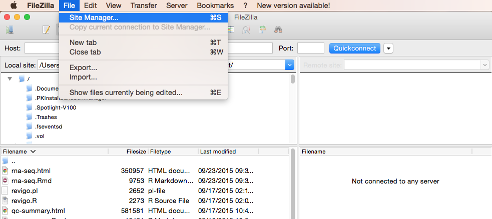
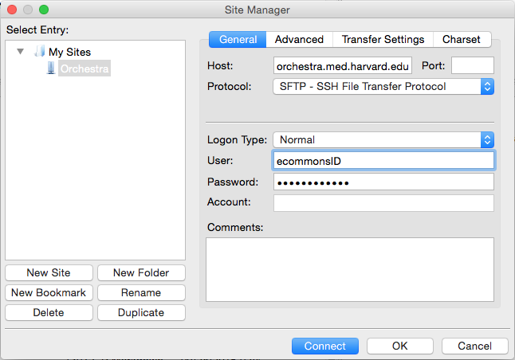

Approximate time: 60 minutes

## Learning Objectives:

* Use a series of command line tools to execute an RNA-Seq workflow
* Learn the intricacies of various tools used in NGS analysis (parameters, usage, etc)
* Understand the contents of a FastQ file
* Be able to evaluate a FastQC report
* Use Trimmommatic to clean FastQ reads
* Use a For loop to automate operations on multiple files


## Running a Workflow

Without getting into the details for each step of the workflow, we first describe a general overview of the steps involved in RNA-Seq analysis:


1. Quality control on sequence reads
2. Trim and/or filter reads (if necessary)
3. Index the reference genome for use by STAR
4. Align reads to reference genome using STAR (splice-aware aligner)
5. Count the number of reads mapping to each gene using htseq-count
6. Statistical analysis (count normalization, linear modeling using R-based tools)


Assessing the quality of your data and performing any necessary quality control measures, such as trimming, is a critical first step in the analysis of your RNA-Seq data. 


So let's get started.

##Quality Control - FASTQC


###Unmapped read data (FASTQ)

NGS reads from a sequencing run are stored in fastq (fasta with qualities). Although it looks complicated  (and maybe it is), its easy to understand the [fastq](https://en.wikipedia.org/wiki/FASTQ_format) format with a little decoding. Some rules about the format include...

|Line|Description|
|----|-----------|
|1|Always begins with '@' and then information about the read|
|2|The actual DNA sequence|
|3|Always begins with a '+' and sometimes the same info in line 1|
|4|Has a string of characters which represent the quality scores; must have same number of characters as line 2|

so for example in our data set, one complete read is:

```
@HWI-ST330:304:H045HADXX:1:1101:1111:61397
CACTTGTAAGGGCAGGCCCCCTTCACCCTCCCGCTCCTGGGGGANNNNNNNNNNANNNCGAGGCCCTGGGGTAGAGGGNNNNNNNNNNNNNNGATCTTGG
+
@?@DDDDDDHHH?GH:?FCBGGB@C?DBEGIIIIAEF;FCGGI#########################################################
```
This is one of our bad reads. 

As mentioned previously, line 4 is an encoding of the quality, which represents the probability that the nucleotide call is incorrect. The legend below provides the quality scores (Phred-33) associated with the quality encoding characters.

 ```
 Quality encoding: !"#$%&'()*+,-./0123456789:;<=>?@ABCDEFGHI
                   |         |         |         |         |
    Quality score: 0........10........20........30........40                                
```
 
Using the quality encoding legend, the first nucelotide in the read (C) is called with a quality score of 31 and our Ns are called with a score of 2.  This quality score is logarithmically based and the score values can be interpreted as follows:

|Phred Quality Score |Probability of incorrect base call |Base call accuracy|
|:-------------------|:---------------------------------:|-----------------:|
|10	|1 in 10 |	90%|
|20	|1 in 100|	99%|
|30	|1 in 1000|	99.9%|
|40	|1 in 10,000|	99.99%|
|50	|1 in 100,000|	99.999%|
|60	|1 in 1,000,000|	99.9999%|

Therefore, for the first nucleotide in the read (C), there is less than a 1 in 1000 chance that the base was called incorrectly.

### FastQC
We have already talked about what information is stored in a FASTQ file earlier. The next step is to assess that information to see if the data contained within are of good quality.

FastQC (http://www.bioinformatics.babraham.ac.uk/projects/fastqc/) provides a simple way to do some quality control checks on raw sequence data coming from high throughput sequencing pipelines. It provides a modular set of analyses which you can use to give a quick impression of whether your data has any problems of which you should be aware before doing any further analysis.

The main functions of FastQC are:

* Import of data from BAM, SAM or FastQ files (any variant)
* Providing a quick overview to tell you in which areas there may be problems
* Summary graphs and tables to quickly assess your data
* Export of results to an HTML based permanent report
* Offline operation to allow automated generation of reports without running the interactive application


### Running FASTQC
####A. Stage your data

To perform our quality checks, we will be working within our recently created `rnaseq_project` directory. We need to create two directories within the `data` directory for this quality control step. 

`$ cd unix_oct2015/rnaseq_project/data`

`$ mkdir untrimmed_fastq`

`$ mkdir trimmed_fastq`
    
The raw_fastq data we will be working with is currently in the `unix_oct2015/raw_fastq` directory. We need to copy the raw fastq files to our `untrimmed_fastq` directory:

`$ cp -r ~/unix_oct2015/raw_fastq/*fq  ~/unix_oct2015/rnaseq_project/data/untrimmed_fastq`

####B. Run FastQC  

Before we run FastQC, let's start an interactive session on the cluster:

`$ bsub -Is -n 1 -q interactive bash`

***An interactive session is a very useful to test tools, workflows, run jobs that open new interactive windows (X11-forwarding) and so on.***

Once your interactive job starts, notice that the command prompt has changed; this is because we are working on a compute node now, not on a login node.

`$ cd ~/unix_oct2015/rnaseq_project/data/untrimmed_fastq/`  

Before we start using software, we have to load the environments for each software package. On clusters, this is typically done using a **module** system. 

If we check which modules we currently have loaded, we should not see Fastqc.

`$ module list`

If we try to run FastQC on one of our fastq files, Orchestra won't be able to find the program.

`$ fastqc Mov10_oe_1.subset.fq`

This is because the fastqc program is not in our $PATH (i.e. its not in a directory that unix will automatically check to run commands/programs).

`$ $PATH`

To run the FastQC program, we first need to load the appropriate module, so it puts the program into our path:

`$ module load seq/fastqc`

Once a module for a tool is loaded, you have essentially made it directly available to you like any other basic UNIX command.

`$ module list`

`$ $PATH`

FastQC will accept multiple file names as input, so we can use the *.fq wildcard.

`$ fastqc *.fq`

*Did you notice how each file was processed serially? How do we speed this up?*

Exit the interactive session and start a new one with 6 cores, and use the multi-threading funcionality of FastQC to run 6 jobs at once.

`$ exit`      #exit the current interactive session
	
`$ bsub -Is -n 6 -q interactive bash`      #start a new one with 6 cpus (-n 6)
	
`$ module load seq/fastqc`     #you'll have to reload the module for the new session
	
`$ fastqc -t 6 *.fq`      #note the extra parameter we specified for 6 threads

How did I know the -t argument for FastQC?

`$ fastqc -help`


Now, let's create a home for our results

`$ mkdir ~/unix_oct2015/rnaseq_project/results/fastqc_untrimmed_reads`

...and move them there (recall, we are still in `~/unix_oct2015/rnaseq_project/data/untrimmed_fastq/`)

`$ mv *.zip ~/unix_oct2015/rnaseq_project/results/fastqc_untrimmed_reads/`

`$ mv *.html ~/unix_oct2015/rnaseq_project/results/fastqc_untrimmed_reads/`

####C. Results
   
Let's take a closer look at the files generated by FastQC:
   
`$ ls -lh ~/unix_oct2015/rnaseq_project/results/fastqc_untrimmed_reads/`

##### HTML reports
The .html files contain the final reports generated by fastqc, let's take a closer look at them. Transfer one of them over to your laptop via *FileZilla*.

Open FileZilla, and click on the File tab. Choose 'Site Manager'.



Within the 'Site Manager' window, do the following: 
	


1. Click on 'New Site', and name it something intuitive (e.g. Orchestra)
2. Host: orchestra.med.harvard.edu 
3. Protocol: SFTP - SSH File Transfer Protocol
4. Logon Type: Normal
5. User: your ECommons ID
6. Password: your ECommons password
7. Click 'Connect'
	
***FastQC is just an indicator of what's going on with your data, don't take the "PASS"es and "FAIL"s too seriously.***

FastQC has a really well documented [manual page](http://www.bioinformatics.babraham.ac.uk/projects/fastqc/) with [more details](http://www.bioinformatics.babraham.ac.uk/projects/fastqc/Help/) about all the plots in the report.

We recommend looking at [this post](http://bioinfo-core.org/index.php/9th_Discussion-28_October_2010) for more information on what bad plots look like and what they mean for your data.

##### .zip files   

Let's go back to the terminal now. The other output of FastQC is a .zip file. These .zip files need to be unpacked with the `unzip` program. If we try to `unzip` them all at once:

`$ cd ~/unix_oct2015/rnaseq_project/results/fastqc_untrimmed_reads/`
    
`$ unzip *.zip`

Did it work? 

No, because `unzip` expects to get only one zip file. Welcome to the real world.
We *could* do each file, one by one, but what if we have 500 files? There is a smarter way.
We can save time by using a simple shell `for loop` to iterate through the list of files in *.zip.

After you type the first line, you will get a special '>' prompt to type next lines.  
You start with 'do', then enter your commands, then end with 'done' to execute the loop.

Note that in the first line, we create a variable named `zip`.  After that, we call that variable with the syntax `$zip`. `$zip` is assigned the value of each item (file) in the list *.zip, once for each iteration of the loop.

This loop is basically a simple program. When it runs

```bash
$ for zip in *.zip
> do
> unzip $zip
> done
```
it will run unzip once for each file (whose name is stored in the $zip variable). The contents of each file will be unpacked into a separate directory by the unzip program.

The 'for loop' is interpreted as a multipart command.  If you press the up arrow on your keyboard to recall the command, it will be shown like so:

    for zip in *.zip; do echo File $zip; unzip $zip; done

When you check your history later, it will help you remember what you did!

##### Document your work

What information is contained in the unzipped folder?

`$ ls -lh *fastqc`

`$ head *fastqc/summary.txt`

To save a record, let's `cat` all `fastqc summary.txt` files into one `full_report.txt` and move this to `~/unix_oct2015/rnaseq_project/docs`. 
You can use wildcards in paths as well as file names.  Do you remember how we said `cat` is really meant for concatenating text files?
    
`$ cat */summary.txt > ~/unix_oct2015/rnaseq_project/docs/fastqc_summaries.txt`


##Quality Control - Trimming


###How to clean reads using *Trimmomatic*

Once we have an idea of the quality of our raw data, it is time to trim away adapters and filter out poor quality score reads. To accomplish this task we will use [*Trimmomatic*](http://www.usadellab.org/cms/?page=trimmomatic).

*Trimmomatic* is a java based program that can remove sequencer specific reads and nucleotides that fall below a certain threshold. *Trimmomatic* can be multithreaded to run quickly. 

Let's load the *Trimmomatic* module:

`$ module load seq/Trimmomatic`

By loading the *Trimmomatic* module, the **trimmomatic-0.33.jar** file is now accessible to us in the **opt/** directory, allowing us to run the program. 

Because *Trimmomatic* is java based, it is run using the command:

`$ java -jar /opt/Trimmomatic-0.33/trimmomatic-0.33.jar`


What follows below are the specific commands that tells the *Trimmomatic* program exactly how you want it to operate. *Trimmomatic* has a variety of options and parameters:

* **_-threads_** How many processors do you want *Trimmomatic* to run with?
* **_SE_** or **_PE_** Single End or Paired End reads?
* **_-phred33_** or **_-phred64_** Which quality score do your reads have?
* **_SLIDINGWINDOW_** Perform sliding window trimming, cutting once the average quality within the window falls below a threshold.
* **_LEADING_** Cut bases off the start of a read, if below a threshold quality.
* **_TRAILING_** Cut bases off the end of a read, if below a threshold quality.
* **_CROP_** Cut the read to a specified length.
* **_HEADCROP_** Cut the specified number of bases from the start of the read.
* **_MINLEN_** Drop an entire read if it is below a specified length.
* **_TOPHRED33_** Convert quality scores to Phred-33.
* **_TOPHRED64_** Convert quality scores to Phred-64.


A general command for *Trimmomatic* on this cluster will look something like this:

```
$ java -jar /opt/Trimmomatic-0.33/trimmomatic-0.33.jar SE \
-threads 4 \
inputfile \
outputfile \
OPTION:VALUE... # DO NOT RUN THIS
```
`java -jar` calls the Java program, which is needed to run *Trimmomatic*, which is a 'jar' file (`trimmomatic-0.33.jar`). A 'jar' file is a special kind of java archive that is often used for programs written in the Java programming language.  If you see a new program that ends in '.jar', you will know it is a java program that is executed `java -jar` <*location of program .jar file*>.  The `SE` argument is a keyword that specifies we are working with single-end reads. We have to specify the `-threads` parameter because Trimmomatic uses 16 threads by default.

The next two arguments are input file and output file names. These are then followed by a series of options. The specifics of how options are passed to a program are different depending on the program. You will always have to read the manual of a new program to learn which way it expects its command-line arguments to be composed.

###Running Trimmomatic

Change directories to the untrimmed fastq data location:

`$ cd ~/unix_oct2015/rnaseq_project/data/untrimmed_fastq`

Let's load the trimmomatic module:

`$ module load seq/Trimmomatic/0.33`

Since the *Timmomatic* command is complicated and we will be running it a number of times, let's draft the command in a text editor, such as Sublime, TextWrangler or Notepad++. When finished, we will copy and paste the command into the terminal.

For the single fastq input file 'Mov10_oe_1.subset.fq', the command would be:

```
$ java -jar /opt/Trimmomatic-0.33/trimmomatic-0.33.jar SE \
-threads 4 \
-phred33 \
Mov10_oe_1.subset.fq \
../trimmed_fastq/Mov10_oe_1.qualtrim25.minlen35.fq \
ILLUMINACLIP:/opt/Trimmomatic-0.33/adapters/TruSeq3-SE.fa:2:30:10 \
TRAILING:25 \
MINLEN:35
```
The backslashes at the end of the lines allow us to continue our script on new lines, which helps with readability of some long commands.

This command tells *Trimmomatic* to run on a fastq file containing Single-End reads (``Mov10_oe_1.subset.fq``, in this case) and to name the output file ``Mov10_oe_1.qualtrim25.minlen35.fq``. The program will remove Illumina adapter sequences given by the file, `TruSeq3-SE.fa` and will cut nucleotides from the 3' end of the sequence if their quality score is below 25. The entire read will be discarded if the length of the read after trimming drops below 35 nucleotides.

After the job finishes, you should see the *Trimmomatic* output in the terminal: 

```
TrimmomaticSE: Started with arguments: -threads 4 -phred33 Mov10_oe_1.subset.fq ../trimmed_fastq/Mov10_oe_1.qualtrim25.minlen35.fq ILLUMINACLIP:/opt/Trimmomatic-0.33/adapters/TruSeq3-SE.fa:2:30:10 TRAILING:25 MINLEN:35
Using Long Clipping Sequence: 'AGATCGGAAGAGCGTCGTGTAGGGAAAGAGTGTA'
Using Long Clipping Sequence: 'AGATCGGAAGAGCACACGTCTGAACTCCAGTCAC'
ILLUMINACLIP: Using 0 prefix pairs, 2 forward/reverse sequences, 0 forward only sequences, 0 reverse only sequences
Input Reads: 305900 Surviving: 300423 (98.21%) Dropped: 5477 (1.79%)
TrimmomaticSE: Completed successfully
```

Now that we know the command successfully runs, let's make the *Trimmomatic* command into a submission script. A submission script is oftentimes preferable to executing commands on the terminal. We can use it to store the parameters we used for a command(s) inside a file. If we need to run the program on other files, we can easily change the script. Also, using scripts to store your commands helps with reproducibility. In the future, if we forget which parameters we used during our analysis, we can just check our script.

To make a *Trimmomatic* submission script for Orchestra:

`$ cd ~/unix_oct2015`

`$ nano trimmomatic_mov10.sh`

Within nano we will add our shebang line, the Orchestra job submission commands, and our Trimmomatic command. Remember that you can find the submission commands in the [Orchestra New User Guide](https://wiki.med.harvard.edu/Orchestra/NewUserGuide).


```
#!/bin/bash

#BSUB -q priority # queue name
#BSUB -W 2:00 # hours:minutes runlimit after which job will be killed.
#BSUB -n 4 # number of cores requested
#BSUB -N piper@hsph.harvard.edu

cd ~/unix_oct2015/rnaseq_project/data/untrimmed_fastq

java -jar /opt/Trimmomatic-0.33/trimmomatic-0.33.jar SE \
-threads 4 \
-phred33 \
Mov10_oe_1.subset.fq \
../trimmed_fastq/Mov10_oe_1.qualtrim25.minlen35.fq \
ILLUMINACLIP:/opt/Trimmomatic-0.33/adapters/TruSeq3-SE.fa:2:30:10 \
TRAILING:25 \
MINLEN:35
```
Now, let's run it:

`$ bsub < trimmomatic_mov10.sh`

After the job finishes, you should receive an email with output: 

```
TrimmomaticSE: Started with arguments: -threads 4 -phred33 Mov10_oe_1.subset.fq ../trimmed_fastq/Mov10_oe_1.qualtrim25.minlen35.fq ILLUMINACLIP:/opt/Trimmomatic-0.33/adapters/TruSeq3-SE.fa:2:30:10 TRAILING:25 MINLEN:35
Using Long Clipping Sequence: 'AGATCGGAAGAGCGTCGTGTAGGGAAAGAGTGTA'
Using Long Clipping Sequence: 'AGATCGGAAGAGCACACGTCTGAACTCCAGTCAC'
ILLUMINACLIP: Using 0 prefix pairs, 2 forward/reverse sequences, 0 forward only sequences, 0 reverse only sequences
Input Reads: 305900 Surviving: 300423 (98.21%) Dropped: 5477 (1.79%)
TrimmomaticSE: Completed successfully
```

We now have a new fastq file with our trimmed and cleaned up data:

`$ ls ../trimmed_fastq/`    


***
**Exercise**

**Run *Trimmomatic* on all the fastq files**

Now we know how to run trimmomatic, but there is some good news and bad news.  
One should always ask for the bad news first.  Trimmomatic only operates on 
one input file at a time and we have more than one input file.  The good news?
We already know how to use a 'for loop' to deal with this situation. Let's modify our script to run the *Trimmomatic* command for every raw fastq file. Let's also run fastqc on each of our trimmed fastq files to evaluate the quality of our reads post-trimming:

```
#!/bin/bash

#BSUB -q priority # queue name
#BSUB -W 2:00 # hours:minutes runlimit after which job will be killed.
#BSUB -n 6 # number of cores requested
#BSUB -N piper@hsph.harvard.edu

cd ~/unix_oct2015/rnaseq_project/data/untrimmed_fastq

module load seq/Trimmomatic
module load seq/fastqc

for infile in *.fq; do

  outfile=$infile.qualtrim25.minlen35.fq;

  java -jar /opt/Trimmomatic-0.33/trimmomatic-0.33.jar SE \
  -threads 4 \
  -phred33 \
  $infile ../trimmed_fastq/$outfile \
  ILLUMINACLIP:/opt/Trimmomatic-0.33/adapters/TruSeq3-SE.fa:2:30:10 \
  TRAILING:25 MINLEN:35;
  
done
    
fastqc -t 6 ../trimmed_fastq/*.fq
```
`$ bsub < trimmomatic_mov10.sh`

It is good practice to load the modules we plan to use at the beginning of the script. Therefore, if we run this script in the future, we don't have to worry about whether we have loaded all of the necessary modules prior to executing the script. 

Do you remember how the variable name in the first line of a 'for loop' specifies a variable that is assigned the value of each item in the list in turn?  We can call it whatever we like.  This time it is called `infile`.  Note that the fifth line of this 'for loop' is creating a second variable called `outfile`.  We assign it the value of `$infile` with `'.qualtrim25.minlen35.fq'` appended to it. **There are no spaces before or after the '='.**

After we have created the trimmed fastq files, we wanted to make sure that the quality of our reads look good, so we ran a *FASTQC* on our `$outfile`, which is located in the ../trimmed_fastq directory.

Let's make a new directory for our fasqc files for the trimmed reads:

`$ mkdir ~/unix_oct2015/rnaseq_project/results/fastqc_trimmed_reads`

Now move all fastqc files to the `fastqc_trimmed_reads` directory:

`$ mv ~/unix_oct2015/rnaseq_project/data/trimmed_fastq/*fastqc**`

Let's use *FileZilla* to download the fastqc html for Mov10_oe_1. Has our read quality improved with trimming?
***

---
*The materials used in this lesson was derived from work that is Copyright © Data Carpentry (http://datacarpentry.org/). 
All Data Carpentry instructional material is made available under the [Creative Commons Attribution license](https://creativecommons.org/licenses/by/4.0/) (CC BY 4.0).*

```
$ java -jar /opt/Trimmomatic-0.33/trimmomatic-0.33.jar SE \
-threads 6 \
-phred33 \
Mov10_oe_1.subset.fq \
../trimmed_Mov10_oe_1.qualtrim25.minlen35.fq \
ILLUMINACLIP:/opt/Trimmomatic-0.33/adapters/TruSeq3-SE.fa:2:30:10 \
TRAILING:25 \
MINLEN:35
```


