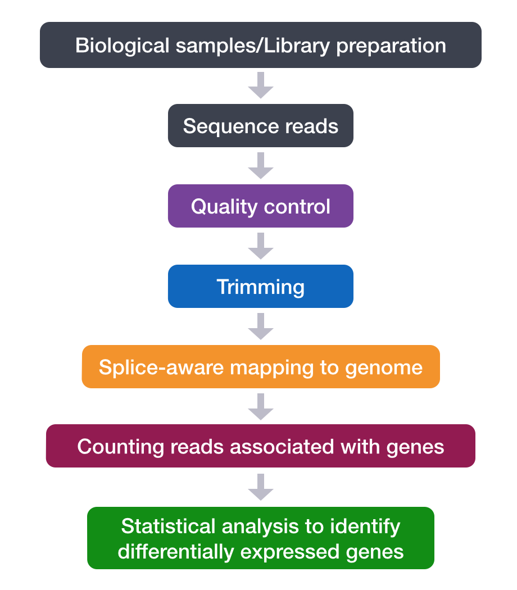

# Lesson

An RNA-Seq workflow
===================

Learning Objectives:
-------------------
### What's the goal for this lesson?

* Use a series of command line tools to execute an RNA-Seq workflow
* Learning intricacies of various tools used in NGS analysis (parameters, usage, etc)
* Assesing input and output filetypes

## Running a Workflow

### Setting up

To get started with this lesson, ensure you are logged into the cluster and are working
in an interactive session on a compute node (single core):

```
ssh username@orchestra.med.harvard.edu
(enter password)

$ bsub -Is -n 6 -q interactive bash	
```

Change directories into the `unix_oct2015` directory and copy the `reference_data` folder into your project directory:

```
$ cp reference_data rnaseq_project/data

```

Now move into the `rnaseq_project` directory. You should have a directory tree setup similar to that shown below. it is best practice to have all files you intend on using for your workflow present within the same directory. In our case, we have our original FASTQ files and post-trimming data generated in the previous section. We also have all reference data files that will be used in downstream analyses.

```
rnaseq_project
	├── data
	│   ├── reference_data
	│   │   └── chr1.fa
	│   │   └── chr1-hg19_genes.gtf
 	|   ├── untrimmed_fastq
	│   │   
	│   └── trimmed_fastq
	│       ├── Irrel_kd_1.qualtrim25.minlen35.fq
	│       ├── Irrel_kd_2.qualtrim25.minlen35.fq
	│       ├── Irrel_kd_3.qualtrim25.minlen35.fq
	│       ├── Mov10_oe_1.qualtrim25.minlen35.fq
	│       ├── Mov10_oe_2.qualtrim25.minlen35.fq
	│       └── Mov10_oe_3.qualtrim25.minlen35.fq
	|
	├── meta
	├── results
	└── docs
```

Without getting into the details for each step of the workflow, we first describe a general overview of the steps involved in RNA-Seq analysis:



1. Quality control on sequence reads
2. Trim and/or filter reads (if necessary)
3. Index the reference genome for use by STAR
4. Align reads to reference genome using STAR (splice-aware aligner)
5. Count the number of reads mapping to each gene using htseq-count
6. Statistical analysis (count normalization, linear modeling using R-based tools)


We'll first perform the commands for all the above steps (run through the workflow) for a single sample.

Next, we'll create a script for the commands and test it. 

Finally, we'll modify the script to run on the cluster.

So let's get started.

The first command is to change into our working directory:

```
$ cd unix_oct2015/rnaseq-project

```

Let's load up some of the modules we need for this section: 

```
     module load seq/samtools
     module load seq/htseq
```

Create an output directory for our alignment files:

```bash
$ mkdir results/STAR

```

In the script, we will eventually loop over all of our files and have the cluster work on each one in parallel. For now, we're going to work on just one to set up our workflow.  To start we will use the trimmed first replicate in the Mov10 overexpression group, `Mov10_oe_1.qualtrim25.minlen35.fq` 


**NOTE: if you did not follow the last section, please execute the following command:** (this will copy over the required files into your home directory.)

```bash

$ cp -r /groups/hbctraining/unix_oct2015_other/trimmed_fastq data/

```

### Alignment to genome
The alignment process consists of choosing an appropriate reference genome to map our reads against, and performing the read alignment using one of several splice-aware alignment tools such as [STAR](http://bioinformatics.oxfordjournals.org/content/early/2012/10/25/bioinformatics.bts635) or [TopHat2](https://ccb.jhu.edu/software/tophat/index.shtml). The choice of aligner is a personal preference and also dependent on the computational resources that are available to you.
 
For this workshop we will be using STAR (Spliced Transcripts Alignment to a Reference), an aligner designed to specifically address many of the challenges of RNAseq
data mapping, and utilizes a novel strategy for spliced alignments. STAR is shown to have high accuracy and outperforms other aligners by more than a factor of 50 in mapping
speed. More details on the algorithm itself can be found in the publication linked above. Aligning reads using STAR is a two step process: 1) Create a genome index 2) Map reads to the genome.

> A quick note on shared databases for human and other commonly used model organisms. The Orchestra cluster has a designated directory at `/groups/shared_databases/` in which there are files that can be accessed by any user. These files contain, but are not limited to, genome inidices for various tools, reference sequences, tool specific data, and data from public databasese such as NCBI and PDB. So when using a tool and requires a reference of sorts, it is worth taking a quick look here because chances are it's already been taken care of for you. 

Indexing of the reference genome has already been done for you. **You do not need to run this code**. For this step you need to provide a reference genome and an annotation file. For this workshop we are using reads that originate from a small subsection of chromosome 1 (~300,00 reads) and so we are using only chr1 as the reference genome, and have provided the appropriate indices. Depending on the size of your genome, this can take awhile. 

The basic options to **generate genome indices** using STAR as follows:


* `--runThreadN`: number of threads
* `--runMode`: genomeGenerate mode
* `--genomeDir`: /path/to/store/genome_indices
* `--genomeFastaFiles`: /path/to/FASTA_file 
* `--sjdbGTFfile`: /path/to/GTF_file
* `--sjdbOverhang`: readlength -1

```
** Do not run this**
STAR --runThreadN 5 --runMode genomeGenerate --genomeDir ./ --genomeFastaFiles chr1.fa --sjdbGTFfile chr1-hg19_genes.gtf --sjdbOverhang 99

```

The basic options for **mapping reads** to the genome using STAR is as follows:

* `--runThreadN`: number of threads
* `--readFilesIn`: /path/to/FASTQ_file
* `--genomeDir`: /path/to/genome_indices
* `--outFileNamePrefix`: prefix for all output files


More details on STAR and its functionality can be found in the [user manual](https://github.com/alexdobin/STAR/blob/master/doc/STARmanual.pdf), we encourage you to peruse through to get familiar with all available options.


_STAR is not available as a module on Orchestra._ To run STAR we will be using an install of the software that is available on the Orchestra cluster at `/opt/bcbio/local/bin`. Since we had previously added this location to our `$PATH` we can access the software by simply using the STAR command followed by the basic parameters described above and any additional parameters. The full command is provided below for you to copy paste into your terminal. Below, we first describe some the extra parameters we have added.

Advanced parameters:

* `--outFilterMultimapNmax`: max number of multiple alignments allowed for a read
* `--outSAMstrandField`: compatability with Cufflinks (for transcriptome assembly)
* `--outReadsUnmapped`: file format for unmapped reads
* `--outSAMtype`: output filetype (SAM default)
* `--outSAMUnmapped`: what to do with unmapped reads
* `--outSAMattributes`: specify SAM attributes in output file


```
STAR --runThreadN 6 --genomeDir /groups/hbctraining/unix_oct2015_other/reference_STAR --readFilesIn data/trimmed_fastq/Mov10_oe_1.qualtrim25.minlen35.fq  --outFileNamePrefix results/STAR/Mov10_oe_1_ --outFilterMultimapNmax 10 --outSAMstrandField intronMotif --outReadsUnmapped Fastx --outSAMtype BAM SortedByCoordinate --outSAMunmapped Within --outSAMattributes NH HI NM MD AS
```

#### Exercise
How many files do you see in your output directory? Using the `less` command take a look at `Mov10_oe_1_Log.final.out` and answer the following questions:  

1. How many reads are uniquely mapped?
2. How many reads map to more than 10 locations on the genome?
3. How many reads are unmapped due to read length?


### SAM/BAM
The output we requested from STAR is a BAM file, and by default returns a file in SAM format. BAM is a binary version of the SAM file, also known as Sequence Alignment Map format. The SAM file is a tab-delimited text file that contains information for each individual read and its alignment to the genome. The file begins with a header, which is optional, followed by an alignment section.  If present, the header must be prior to the alignments and starts with '@'. Each line that follows corresponds to alignment information for a read. Each alignment line has 11 mandatory fields for essential mapping information and a variable number of fields for aligner specific information.


These fields are described briefly below, but for more detailed information the paper by [Heng Li et al](http://bioinformatics.oxfordjournals.org/content/25/16/2078.full) is a good start.


Let's take a quick look at our alignment. To do so we first convert our BAM file into SAM format using samtools:

```
$ samtools view -h results/STAR/Mov10_oe_1_Aligned.sortedByCoord.out.bam > Mov10_oe_1_Aligned.sortedByCoord.out.sam

```
 
Now we can use the `less` command to scroll through the SAM file and see how the fields correspond to what we expected.

### Assess the alignment (visualization)

Index the BAM file for visualization with IGV:

    samtools index results/STAR/Mov10_oe_1__Aligned.sortedByCoord.out.bam

**Transfer files to your laptop using the command line**

We previously used FileZilla to transfer files from Orchestra to your laptop. However, there is another way to do so using the command line interface. _This option is only available for Mac and Linux users! PC users can use Filezilla._  Similar to the `cp` command to copy there is a command that allows you to securely copy files between computers. The command is called `scp` and allows files to be copied to, from, or between different hosts. It uses ssh for data transfer and provides the same authentication and same level of security as ssh. 

First, identify the location of the _origin file_ you intend to copy, followed by the _destination_ of that file. Since the origin file is located on Orchestra, this requires you to provide remote host and login information.

The following 2 files need to be moved from Orchestra to your local machine,
 
`results/STAR/Mov10_oe_1_Aligned.sortedByCoord.out.bam`,

`results/STAR/Mov10_oe_1_Aligned.sortedByCoord.out.bam.bai` 

```
$ scp user_name@orchestra.med.harvard.edu:/home/user_name/unix_oct2015/rnaseq_project/results/Mov10_oe_1_Aligned.sortedByCoord.out.bam* /path/to/directory_on_laptop
```


**Visualize**

* Start [IGV](https://www.broadinstitute.org/software/igv/download) _You should have this previously installed on your laptop_
* Load the Human genome (hg19) into IGV using the dropdown menu at the top left of your screen. _Note: there is also an option to "Load Genomes from File..." under the "Genomes" pull-down menu - this is useful when working with non-model organisms_
* Load the .bam file using the **"Load from File..."** option under the **"File"** pull-down menu. *IGV requires the .bai file to be in the same location as the .bam file that is loaded into IGV, but there is no direct use for that file.*


#### Exercise
Now that we have done this for one sample, let's try using the same commands to perform alignment on one of the control samples. Using `Irrel_kd_1_qualtrim25.minlen35.fq` walk through the alignment commands above. Copy over the resulting BAM and index file to your laptop and upload into IGV for visualization. 

1. How does the MOV10 gene look in the control sample in comparison to the overexpression sample?
2. Take a look at a few other genes by typing into the search bar. For example, PPM1J and PTPN22. How do these genes compare? 


### Counting reads
Once we have our reads aligned to the genome, the next step is to count how many reads have been mapped to each gene. Counting is done with a tool called [htseq-count](http://www-huber.embl.de/users/anders/HTSeq/doc/count.html). The input files required for counting include the BAM file and an associated gene annotation file in GTF format. htseq-count works by taking the alignment coordinates for each read and cross-referencing that to the coordinates for features described in the GTF. Most commonly a feature is considered to be a gene, which is the union of all exons (which is a feature type) that map to that gene. There is no minimum overlap to determine whether or not a read is counted for a particular gene, rather it is the mode that the user chooses. 

There are three modes available and are listed below in order of stringency, with most conservative at the top:

1. intersection-strict
2. union
3. intersection non-empty


We will be using the 'union' mode as it is default and most commonly used. To find out more on the different modes and how they affect your output, take a look at the [manual](http://www-huber.embl.de/users/anders/HTSeq/doc/count.html)


Let's start by creating a directory for the output:

```
$ mkdir results/counts
```

In it's most basic form the htseq command requires only the BAM file and the GTF file. We will add in a few additional parameters including `--format` to indicate BAM file, and `--stranded reverse` to specify that we have a stranded library created via the dUTP method. By default htseq-count will _ignore any reads that map to multiple locations_ on the genome. This results in undercounting but also helps reduce false positives. While multi-mappers are a feature that cannot be modified, there is a parameter that allows the user to filter reads by specifying a minimum alignment quality. 

You will notice at the end of the command we have added a redirection symbol. Since htseq-count outputs results to screen, we need to re-direct it to file.

```
htseq-count --stranded reverse --format bam results/STAR/Mov10_oe_1_Aligned.sortedByCoord.out.bam data/reference_data/Irrel_kd_1_qualtrim25.minlen35.fq  >  results/counts/Mov10_oe_1.counts
```

#### Exercise
Take a look at the end of the file using the `tail` command. You should see a summary of how the reads were classified. 

1. How many reads were assigned as no_feature? Why would they be classified this way?
2. How many reads were found to map to multiple locations?


