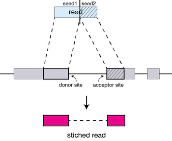

Approximate time:

## Learning Objectives:

* Understanding the alignment method STAR utilizes to align sequence reads to the reference genome
* Identifying the intricacies of alignment tools used in NGS analysis (parameters, usage, etc)
* Choosing appropriate STAR alignment parameters for our dataset
* Running STAR on multiple samples

[ADD WORKFLOW IMG]

## Read Alignment

The alignment process consists of choosing an appropriate reference genome to map our reads against and performing the read alignment using one of several splice-aware alignment tools such as [STAR](http://bioinformatics.oxfordjournals.org/content/early/2012/10/25/bioinformatics.bts635) or [TopHat2](https://ccb.jhu.edu/software/tophat/index.shtml). The choice of aligner is a personal preference and also dependent on the computational resources that are available to you.

## STAR Aligner

To determine where on the human genome our reads originated from, we will align our reads to the reference genome using [STAR](http://www.ncbi.nlm.nih.gov/pmc/articles/PMC3530905/) (Spliced Transcripts Alignment to a Reference). STAR is an aligner designed to specifically address many of the challenges of RNA-seq data mapping using a novel strategy for spliced alignments. 

### STAR Alignment Strategy

STAR is shown to have high accuracy and outperforms other aligners by more than a factor of 50 in mapping speed (but also requires quite a bit of memory). The algorithm achieves this highly efficient mapping by performing a two-step process:

1. Seed searching
2. Clustering, stitching, and scoring

#### Seed searching

For every read that STAR aligns, STAR will search for the longest sequence that exactly matches one or more locations on the reference genome. These longest matching sequences are called the Maximal Mappable Prefixes (MMPs):


	
The different parts of the read that are mapped separately are called 'seeds'. So the first MMP that is mapped to the genome is called *seed1*.

STAR will then search again for only the unmapped portion of the read to find the next longest sequence that exactly matches the reference genome, or the next MMP, which will be *seed2*. 


This sequential searching of only the unmapped portions of reads underlies the efficiency of the STAR algorithm. STAR uses an uncompressed suffix array (SA) to efficiently search for the MMPs, this allows for quick searching against even the largest reference genomes. Other slower aligners use algorithms that often search for the entire read sequence before splitting reads and performing iterative rounds of mapping.

If STAR does not find an exact matching sequence for each part of the read due to mismatches or indels, the previous MMPs will be extended.


If extension does not give a good alignment, then the poor quality or adapter sequence (or other contaminating sequence) will be soft clipped.


#### Clustering, stitching, and scoring

The separate seeds are stitched together to create a complete read by first clustering the seeds together based on proximity to a set of 'anchor' seeds, or seeds that are not multi-mapping.

Then the seeds are stitched together based on the best alignment for the read (scoring based on mismatches, indels, gaps, etc.). 



### Running STAR

#### Set-up

To get started with this lesson, start an interactive session with 6 cores:

```
$ bsub -Is -n 6 -q interactive bash	
```

Change directories into the `rnaseq` folder. 

```
$ cd ngs_course/rnaseq

```

You should have a directory tree setup similar to that shown below. it is best practice to have all files you intend on using for your workflow present within the same directory. In our case, we have our original FASTQ files and post-trimming data generated in the previous section. We also have all reference data files that will be used in downstream analyses.

```
rnaseq
	├── data
	│   ├── reference_data
	│   │   └── chr1.fa
	│   │   └── chr1-hg19_genes.gtf
 	|   ├── untrimmed_fastq
	│   │   
	│   └── trimmed_fastq
	│       ├── Irrel_kd_1.subset.fq.qualtrim25.minlen35.fq
	│       ├── Irrel_kd_2.subset.fq.qualtrim25.minlen35.fq
	│       ├── Irrel_kd_3.subset.fq.qualtrim25.minlen35.fq
	│       ├── Mov10_oe_1.subset.fq.qualtrim25.minlen35.fq
	│       ├── Mov10_oe_2.subset.fq.qualtrim25.minlen35.fq
	│       └── Mov10_oe_3.subset.fq.qualtrim25.minlen35.fq
	|
	├── meta
	├── results
	└── docs
```


To use the STAR aligner, load the Orchestra module: 

```
$ module load seq/STAR/2.4.0j
```

#### Aligning Reads


Aligning reads using STAR is a two step process:   

1. Create a genome index 
2. Map reads to the genome

> A quick note on shared databases for human and other commonly used model organisms. The Orchestra cluster has a designated directory at `/groups/shared_databases/` in which there are files that can be accessed by any user. These files contain, but are not limited to, genome indices for various tools, reference sequences, tool specific data, and data from public databasese such as NCBI and PDB. So when using a tool and requires a reference of sorts, it is worth taking a quick look here because chances are it's already been taken care of for you. 

```
$ ls -l /groups/shared_databases/igenome/
```

##### Creating a genome index

Indexing of the reference genome has already been done for you. **You do not need to run this code**. For this step you need to provide a reference genome and an annotation file. For this workshop we are using reads that originate from a small subsection of chromosome 1 (~300,000 reads) and so we are using only chr1 as the reference genome, and we have provided the appropriate indices. Depending on the size of your genome, this can take a while. 

To store our genome indices, we need to create a directory:

```
$ mkdir my_genome_index
```

The basic options to **generate genome indices** using STAR are as follows:


* `--runThreadN`: number of threads
* `--runMode`: genomeGenerate mode
* `--genomeDir`: /path/to/store/genome_indices
* `--genomeFastaFiles`: /path/to/FASTA_file 
* `--sjdbGTFfile`: /path/to/GTF_file
* `--sjdbOverhang`: readlength -1


Now let's create a job submission script to generate the genome index:

```
$ vim genome_index.lsf
```
Within `vim` we now add our shebang line, the Orchestra job submission commands, and our STAR command. 

```
#!/bin/bash

#BSUB -q priority # queue name
#BSUB -W 2:00 # hours:minutes runlimit after which job will be killed.
#BSUB -n 5 # number of cores requested
#BSUB -J STAR_index         # Job name
#BSUB -o %J.out       # File to which standard out will be written
#BSUB -e %J.err       # File to which standard err will be written

STAR --runThreadN 5 \
--runMode genomeGenerate \
--genomeDir my_genome_index \
--genomeFastaFiles chr1.fa \
--sjdbGTFfile chr1-hg19_genes.gtf \
--sjdbOverhang 99

```

##### Aligning reads

After you have the genome indices generated, you can perform the read alignment. We previously generated the genome indices for you in `/groups/hbctraining/ngs-data-analysis2016/rnaseq/reference_data/reference_STAR` directory so that we don't get held up waiting on the indices.

Change directories to the `rnaseq` folder and create an output directory for our alignment files:

```bash

$ cd ~/ngs_course/rnaseq

$ mkdir results/STAR

```

For now, we're going to work on just one sample to set up our workflow. To start we will use the trimmed first replicate in the Mov10 over-expression group, `Mov10_oe_1.subset.fq.qualtrim25.minlen35.fq`. Details on STAR and its functionality can be found in the [user manual](https://github.com/alexdobin/STAR/blob/master/doc/STARmanual.pdf), we encourage you to peruse through to get familiar with all available options.

The basic options for aligning reads to the genome using STAR are:

* `--runThreadN`: number of threads
* `--readFilesIn`: /path/to/FASTQ_file
* `--genomeDir`: /path/to/genome_indices
* `--outFileNamePrefix`: prefix for all output files

Listed below are additional parameters that we will use in our command:

* `--outFilterMultimapNmax`: max number of multiple alignments allowed for a read
* `--outReadsUnmapped`: file format for unmapped reads
* `--outSAMtype`: output filetype (SAM default)
* `--outSAMUnmapped`: what to do with unmapped reads
* `--outSAMattributes`: specify SAM attributes in output file

We can access the software by simply using the STAR command followed by the basic parameters described above and any additional parameters. The full command is provided below for you to copy paste into your terminal. If you want to manually enter the command, it is advisable to first type out the full command in a text editor (i.e. [Sublime Text](http://www.sublimetext.com/) or [Notepad++](https://notepad-plus-plus.org/)) on your local machine and then copy paste into the terminal. This will make it easier to catch typos and make appropriate changes. 


```
STAR --genomeDir /groups/hbctraining/ngs-data-analysis2016/rnaseq/reference_data/reference_STAR \
--runThreadN 6 \
--readFilesIn data/trimmed_fastq/Mov10_oe_1.subset.fq.qualtrim25.minlen35.fq \
--outFileNamePrefix results/STAR/Mov10_oe_1_ \
--outFilterMultimapNmax 10 \
--outReadsUnmapped Fastx \
--outSAMtype BAM SortedByCoordinate \
--outSAMunmapped Within \
--outSAMattributes Standard \

```


### Running STAR on multiple samples

The interactive queue on Orchestra offers a great way to test commands to make sure they perform the way you intend before adding them a script. Now that we know the STAR command executed properly, let's create a script to run align the take a filename as input, then use a loop to submit the script for each of the trimmed fastq files.

To write our script we need to learn about a few other commands or variables:

#### Section on command line parameter variables

#### Introduce basename and use of $ to create a variable as a result of a command

#### Create a script to run STAR on a file specified in the command prompt

```
$ vim star_analysis_on_input_file.sh
```

```
#!/bin/bash

fq=$1

# location of genome reference index files + the gene annotation file

genome=/groups/hbctraining/ngs-data-analysis2016/rnaseq/reference_data/reference_STAR 

gtf=~/ngs_course/rnaseq/reference_data/chr1-hg19_genes.gtf

# set up our software environment

module load seq/STAR/2.4.0j

# feedback from our script to help with future debugging

echo "Processing file $fq ..."

# grab base of filename for future naming
base=$(basename $fq .subset.fq.qualtrim25.minlen35.fq)

echo "basename is $base"

```

There are 2 new things of note above:

1. the `basename` command: this command takes a path or a name and trims away all the information before the last `\` and if you specify the string to clear away at the end, it will do that as well. In this case, if the variable `$fq` contains the path "~/ngs_course/rnaseq/data/trimmed_fastq/Mov10_oe_1.subset.fq.qualtrim25.minlen35.fq", `basename $fq .subset.fq.qualtrim25.minlen35.fq` will output "Mov10_oe_1".
2. to assign this value to the `base` variable, we place the `basename ...` command in parentheses and put a `$` outside. This syntax is necessary for assigning the output of a command to a variable.

```
# set up output filenames and locations

align_out=~/ngs_course/rnaseq/results/STAR/${base}_
```

Our variables are now staged. We now need to modify the STAR command to use it so that it will run the steps of the analytical workflow with more flexibility:

```
# Run STAR
STAR --runThreadN 6 \
--genomeDir $genome \
--readFilesIn $fq \
--outFileNamePrefix $align_out \
--outFilterMultimapNmax 10 \
--outSAMstrandField intronMotif \
--outReadsUnmapped Fastx \
--outSAMtype BAM SortedByCoordinate \
--outSAMunmapped Within \
--outSAMattributes Standard 
```
Once you save this new script, it is ready for running:

```
$ chmod u+rwx star_analysis_on_input_file.sh      # make it executable, this is good to do, even if your script runs fine without it to ensure that it always does and you are able to tell that it's an executable shell script.

$ sh star_analysis_on_input_file.sh <name of fastq>
```
It is always nice to have comments at the top of a more complex script to make sure that when your future self, or a co-worker, uses it they know exactly how to run it and what the script will do. So for our script, we can have the following lines of comments right at the top after #!/bin/bash/:

```
# This script takes a trimmed fastq file of RNA-Seq data and outputs a alignment files for it.
# USAGE: sh star_analysis_on_input_file.sh <name of fastq file>
```

#### Running our script iteratively as a job submission to the LSF scheduler - REMOVE THIS SECTION

**The above script will run in an interactive session for one file at a time. If we wanted to run this script as a job submission to LSF, and with only one command have LSF run through the analysis for all your input fastq files?**

To run the above script iteratively for all of the files on a worker node via the job scheduler, we need to create a **new submission script** that will need 2 important components:

1. our **LSF directives** at the beginning of the script. This is so that the scheduler knows what resources we need in order to run our job on the compute node(s).
2. a **for loop** that iterates through and runs the above script for all the fastq files.

Let's create a new file with `vim` and call it `rnaseq_analysis_on_allfiles.lsf`:

```
$ vim rnaseq_analysis_on_allfiles.lsf
```

The top of the file should contain the shebang line and LSF directives:

```
#!/bin/bash

#BSUB -q priority       # Partition to submit to (comma separated)
#BSUB -n 6                  # Number of cores, since we are running the STAR command with 6 threads
#BSUB -W 1:30               # Runtime in D-HH:MM (or use minutes)
#BSUB -R "rusage[mem=4000]"    # Memory in MB
#BSUB -J rnaseq_mov10         # Job name
#BSUB -o %J.out       # File to which standard out will be written
#BSUB -e %J.err       # File to which standard err will be written

# this for loop, will take our trimmed fastq files as input and run the script for all of them one after the other. 

for fq in ~/ngs_course/rnaseq/data/trimmed_fastq/*.fq; do
        sh star_analysis_on_input_file.sh $fq;
done
```


```
$ bsub < rnaseq_analysis_on_allfiles.lsf
```

#### Parallelizing workflow for efficiency

**The above script will run through the analysis for all your input fastq files, but it will do so in serial. We can set it up so that the pipeline is working on all the trimmed data in parallel (at the same time). This will save us a lot of time when we have realistic datasets.**

Let's make a modified version of the above script to parallelize our analysis. To do this need to modify one major aspect which will enable us to work with some of the constraints that this scheduler (LSF) has. We will be using a `for loop` for submission and putting the directives for each submission in the bsub command.

Let's make a new file called `rnaseq_analysis_on_allfiles-for_lsf.sh`. Note this is a normal shell script.

```
$ vim rnaseq_analysis_on_allfiles_for-lsf.sh
```

This file will loop through the same files as in the previous script, but the command it submits will be the actual bsub command:

```
#!/bin/bash

for fq in ~/ngs_course/rnaseq/data/trimmed_fastq/*.fq
do
  bsub -q priority -n 6 -W 1:30 -R "rusage[mem=4000]" -J rnaseq_mov10 -o %J.out -e %J.err "sh star_analysis_on_input_file.sh $fq"
  sleep 1
done
```

**In the above for loop please note that after the bsub directives the sh rnaseq_analysis_on_input_file.sh $fq command is in quotes!**

>NOTE: All job schedulers are similar, but not the same. Once you understand how one works, you can transition to another one without too much trouble. They all have their pros and cons that the system administrators for your setup have taken into consideration and picked one that fits the needs of the users best.
What you should see on the output of your screen would be the jobIDs that are returned from the scheduler for each of the jobs that your script submitted.

You can see their progress by using the bjobs command (though there is a lag of about 60 seconds between what is happening and what is reported).

Don't forget about the bkill command, should something go wrong and you need to cancel your jobs.
```

---
*This lesson has been developed by members of the teaching team at the [Harvard Chan Bioinformatics Core (HBC)](http://bioinformatics.sph.harvard.edu/). All instructional material is made available under the [Creative Commons Attribution license](https://creativecommons.org/licenses/by/4.0/) (CC BY 4.0).*


