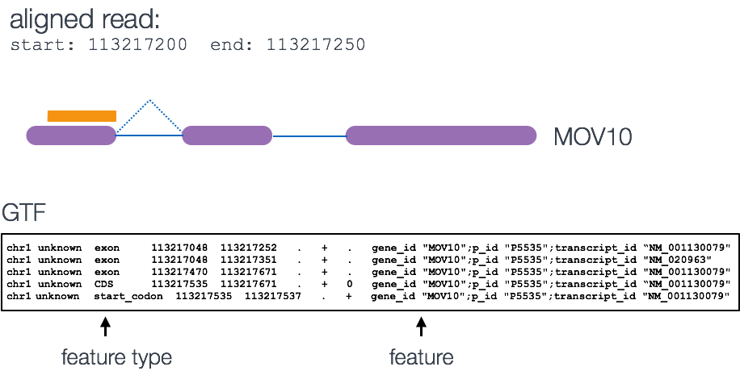

Approximate time: 

## Learning Objectives:

* learn about tools that generate read counts, a measure of gene expression
* learn how to use the featureCounts tool to generate a count matrix for statistical analyses

## Counting reads as a measure of gene expression

Once we have our reads aligned to the genome, the next step is to count how many reads have mapped to each gene. There are many tools that can use BAM files as input and output the number of reads (counts) associated with each feature of interest (genes, exons, transcripts, etc.). There are 2 commonly used counting tools, [featureCounts](http://bioinf.wehi.edu.au/featureCounts/) and [htseq-count](http://www-huber.embl.de/users/anders/HTSeq/doc/count.html). 

**Input for counting**: BAM files + GTF file.
Simply speaking, the genomic coordinates of where the read is mapped (BAM) are cross-referenced with the genomic coordinates of the known exons/genes (GTF).

**Output for counting**: A count matrix, with genes as rows and samples are columns. These are considered the "raw" counts and will be used in statistical programs downstream for differential gene expression.

### Counting using featureCounts
Today, we will be using the featureCounts tool to get the gene counts, since this tool is accurate and it is easy to use. Most commonly a feature is considered to be a gene ('gene_id' in a GTF), which is the union of all exons that "belong" to that gene.

By default

	
	$ featureCounts 

	  Version 1.4.4

	  Usage: featureCounts [options] -a <annotation_file> -o <output_file> input_file1 [input_file2] ... 

Let's start by creating a directory for the output:

	$ mkdir results/counts

	$ export PATH=/opt/bcbio/local/bin:$PATH

In it's most basic form the htseq command requires only the BAM file and the GTF file. We will add in a few additional parameters including `--format` to indicate BAM file, and `--stranded reverse` to specify that we have a stranded library created via the dUTP method. By default htseq-count will _ignore any reads that map to multiple locations_ on the genome. This results in undercounting but also helps reduce false positives. While multi-mappers are a feature that cannot be modified, there is a parameter that allows the user to filter reads by specifying a minimum alignment quality. 

You will notice at the end of the command we have added a redirection symbol. Since htseq-count outputs results to screen, we need to re-direct it to file.

	featureCounts -T 6 -a ~/ngs_course/unix_lesson/reference_data/chr1-hg19_genes.gtf \
		-o ~/ngs_course/unix_lesson/rnaseq/results/counts/counts.txt \
		-s 2 \
		~/ngs_course/unix_lesson/rnaseq/results/STAR/*bam

#### Exercise
Take a look at the end of the file using the `tail` command. You should see a summary of how the reads were classified. 

1. How many reads were assigned as no_feature? Why would they be classified this way?
2. How many reads were found to map to multiple locations?

