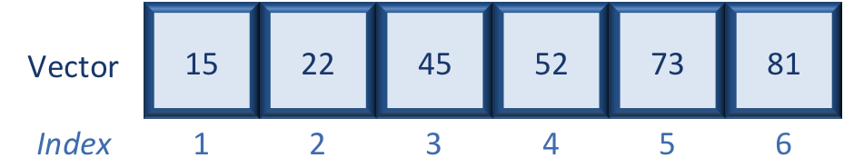
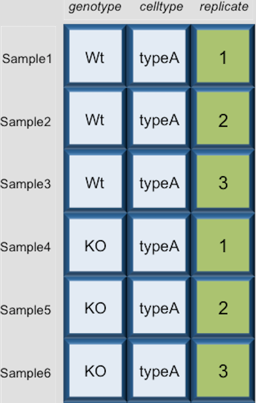

## Learning Objectives
* Reading data into R
* Inspecting data structures
* Using indexes and sequences to select data from vectors and dataframes
* Subsetting data using logical operators
* Writing data to file


## Reading data into R
Regardless of the specific analysis in R we are performing, we usually need to bring data in for the analysis. The function in R we use will depend on the type of data file we are bringing in (e.g. text, Stata, SPSS, SAS, Excel, etc.) and how the data in that file are separated, or delimited. The table below lists functions that can be used to import data from common file formats.

| Data Type  | Function | Package
| -----------:|:----------------:|:---------------:|
| comma separated (.csv)  | read.csv()	| utils (default) |
| other delimited formats (.txt) | read.table(); read.csv() | utils (default) |
| Stata version 7-12 (.dta) | read.dta() | foreign |
| Stata version 13-14 (.dta) | readdta() | haven |
| SPSS (.sav) |	read.spss() | foreign |
| SAS (.sas7bdat) | read.sas7bdat() | sas7bdat |
| Excel (.xls, .xlsx) | readWorksheetFromFile() | XLConnect |
 

For example, if we have text file separated by commas (comma-separated values), we could use the function `read.csv`. However, if the data are separated by a different delimiter in a text file, we could use the generic `read.table` function and specify the delimiter as an argument in the function. 

When working with genomic data, we often have a metadata file containing information on each sample in our dataset. Let's bring in the metadata file using the `read.csv` function. Check the arguments for the function to get an idea of the function options:

```
?read.csv
```

The `read.csv` function has *one required argument* and several *options* that can be specified. The mandatory argument is a path to the file and filename, which in our case is `data/mouse_exp_design.csv`. We will put the function to the right of the assignment operator, meaning that **any output will be saved as the variable name provided on the left**.

	metadata <- read.csv(file='data/mouse_exp_design.csv')

> *Note: By default, `read.csv` converts (= coerces) columns that contain characters (i.e., text) into the `factor` data type. Depending on what you want to do with the data, you may want to keep these columns as `character`. To do so, `read.csv()` and `read.table()` have an argument called `stringsAsFactors` which can be set to `FALSE`.*
> 


## Inspecting data structures

There are a wide selection of base functions in R that are useful for inspecting your data and summarizing it. Let's use the `metadata` file that we created to test out data inspection functions. 

Take a look at the dataframe by typing out the variable name `metadata` and pressing return; the variable contains information describing the samples in our study. Each row holds information for a single sample, and the columns represent `genotype`(WT or KO),  `celltype` (typeA or typeB), and `replicate number`.


	metadata

```
          genotype celltype replicate
sample1        Wt    typeA		1
sample2        Wt    typeA		2
sample3        Wt    typeA		3
sample4        KO    typeA		1
sample5        KO    typeA		2
sample6        KO    typeA		3
sample7        Wt    typeB		1
sample8        Wt    typeB		2
sample9        Wt    typeB		3
sample10       KO    typeB		1
sample11       KO    typeB		2
sample12       KO    typeB		3

```

Suppose we had a larger file, we might not want to display all the contents in the console. Instead we could check the top (the first 6 lines) of this `data.frame` using the function `head()`:


	head(metadata)


Previously, we had mentioned that character values get converted to factors by default using `data.frame`. Another way to assess this change would be to use the __`str`__ucture function. You will get specific details on each column:


	str(metadata)


```
'data.frame':	12 obs. of  3 variables:
 $ genotype : Factor w/ 2 levels "KO","Wt": 2 2 2 1 1 1 2 2 2 1 ...
 $ celltype : Factor w/ 2 levels "typeA","typeB": 1 1 1 1 1 1 2 2 2 2 ...
 $ replicate: num  1 2 3 1 2 3 1 2 3 1 ...
```

As you can see, the columns `genotype` and `celltype` are of the `factor` class, whereas the replicate column has been interpreted as integer data type.

__You can also get this information from the "Environment" tab in RStudio.__

### List of functions for data inspection

We already saw how the functions `head()` and `str()` can be useful to check the
content and the structure of a `data.frame`. Here is a non-exhaustive list of
functions to get a sense of the content/structure of data.

* All data structures - content display:
	- **`str()`:** compact display of data contents (env.)
	- **`class()`:** data type (e.g. character, numeric, etc.) of vectors and data structure of dataframes, matrices, and lists.
	- **`summary()`:** detailed display, including descriptive statistics, frequencies
	- **`head()`:** will print the beginning entries for the variable
	- **`tail()`:** will print the end entries for the variable
* Vector and factor variables: 
	- **`length()`:** returns the number of elements in the vector or factor
* Dataframe and matrix variables:
	- **`dim()`:** returns dimensions of the dataset
	- **`nrow()`:** returns the number of rows in the dataset
	- **`ncol()`:** returns the number of columns in the dataset
	- **`rownames()`:** returns the row names in the dataset  
	- **`colnames()`:** returns the column names in the dataset

## Selecting data using indexes and sequences

When analyzing data, we often want to **partition the data so that we are only working with selected columns or rows.** A data frame or data matrix is simply a collection of vectors combined together. So let's begin with vectors and how to access different elements, and then extend those concepts to dataframes.

### Vectors

If we want to extract one or several values from a vector, we must provide one or several indexes using square brackets `[ ]` syntax. The **index represents the element number within a vector** (or the compartment number, if you think of the bucket analogy). R indexes start at 1. Programming languages like Fortran, MATLAB, and R start counting at 1, because that's what human beings typically do. Languages in the C family (including C++, Java, Perl, and Python) count from 0 because that's simpler for computers to do.

Let's start by creating a vector called age:

	age <- c(15, 22, 45, 52, 73, 81)



Suppose we only wanted the fifth value of this vector, we would use the following syntax:

	age[5]
	
If we wanted all values except the fifth value of this vector, we would use the following:

	age[-5]

If we wanted to select more than one element we would still use the square bracket syntax, but rather than using a single value we would pass in a *vector of several index values*:

	idx <- c(3,5,6) # create vector of the elements of interest
	age[idx]


To select a sequence of continuous values from a vector, we would use `:` which is a special function that creates numeric vectors of integer in increasing or decreasing order. Let's select the *first four values* from age:

	age[1:4]

Alternatively, if you wanted the reverse could try `4:1` for instance, and see what is returned. 

We can also use indexes with logical operators. Logical operators include greater than (>), less than (<), and equal to (==). A full list of logical operators in R is displayed below:

| Operator | Description |
| :-----------:|:----------------|
| > | greater than |
| >= | greater than or equal to|
| < | less than |
| <= | less than or equal to |
| == | equal to |
| != | not equal to |
| & | and |
| \| |or |

Let's create an index with logical operators to select all values in the `age` vector over 50 **or** `age` less than 18:

	idx <- age > 50 | age < 18
	
	age[idx]


### Factors

We briefly introduced factors in the last lesson, but factors only become more intuitive once you've had a chance to work with them. The elements of the `expression` factor created previously had the following categories or levels: low, medium, and high. The categories were assigned integers alphabetically, with high=1, low=2, medium=3 . To view the integer assignments under the hood you can use `str`:

	str(expression)
	
	Factor w/ 3 levels "high","low","medium": 2 1 3 1 2 3 1

The unique elements are referred to as "factor levels", and we can use the function `levels()` to idenitfy the different categories/levels for a factor:  

	levels(expression)

With the establishment of defined levels, we can then use the `summary()` function to classify and count the elements for each level: 

	summary(expression)

Factors can be ordered or unordered. Sometimes, the order of the factors does not matter, other times you might want to specify the order because it is meaningful (e.g., "low" < "medium" < "high") or it is required by particular type of analysis. 

In the example above, the factor is unordered. You can check this by trying the following:

	min(expression) # doesn't work!

To order factor levels, you can simply add an argument to the function `ordered=TRUE`:

	factor(expression, ordered=TRUE)
	
	[1] low    high   medium high   low    medium high  
	Levels: high < low < medium

But what you'll find is that by default R will order levels by alpahabetical order. In order to get the desired ordering (i.e. "low" < "medium" < "high") we need to specify the order of levels and add the argument `ordered=TRUE`.

```{r}
expression <- factor(expression, levels=c("low", "medium", "high"), ordered=TRUE)
levels(expression)
min(expression) ## works!
```
Since factors are special vectors, the same rules for selecting values using indices apply. Let's extract the values of the factor with `high` expression:

First, we create a vector of indices:

```{r}
idx <- expression == "high"
```

Then, we use the brackets `[ ]` to extract those values from the dataset:

```{r}
expression[idx]
```
 
***
**Exercise**

1. Use the `samplegroup` vector we created in a previous lesson, and change that to an ordered factor such that KO < CTL < OE. 
2. Extract only the elements in `samplegroup` that are not KO.

***

### Dataframes

Dataframes (and matrices) have 2 dimensions (rows and columns), so if we want to select some specific data from it we need to specify the "coordinates" we want from it. We use the same square bracket notation but rather than providing a single index, there are *two indexes required*. Within the square bracket, **row numbers come first followed by column numbers (and the two are separated by a comma)**. Let's explore the `metadata` dataframe, shown below are the first six samples:



For example:

	metadata[1, 1]   # element from the first row in the first column of the data frame
	metadata[1, 3]   # element from the first row in the 3rd column

Now if you only wanted to select based on rows, you would provide the index for the rows and leave the columns index blank. The key here is to include the comma, to let R know that you are accessing a 2-dimensional data structure:

	metadata[3, ]    # vector containing all elements in the 3rd row

If you were selecting specific columns from the data frame - the rows are left blank:

	metadata[ ,3]    # vector containing all elements in the 3rd column
	
Just like with vectors, you can select multiple rows and columns at a time. Within the square brackets, you need to provide a vector of the desired values:	

	metadata[ ,1:2] # dataframe containing first two columns
	metadata[c(1,3,6), ] # dataframe containing first, third and seventh rows


For larger datasets, it can be tricky to remember the column number that corresponds to a particular variable. (Is celltype in column 1
or 2? oh, right... they are in column 1). In some cases, the column number for a variable can change if the script you are using adds or removes
columns. It's therefore often better to use column names to refer to a particular variable, and it makes your code easier to read and your intentions clearer.

You can do operations on a particular column, by selecting it using the `$` sign. In this case, the entire column is a vector. For instance, to extract all the gentotypes from our dataset, we can use: 

	metadata$genotype 

You can use `names(metadata)` or `colnames(metadata)` to remind yourself of the column names. We can then supply index values to select specific values from that vector. For example, if we wanted the genotype information for the first five samples in `metadata`:

	metadata$genotype[1:5]

The `$` allows you to select a single column by name. To select multiple columns by name, you need to  concatenate a vector of strings that correspond to column names: 

```
metadata[, c("genotype", "celltype")]
```

```
          genotype celltype
sample1        Wt    typeA
sample2        Wt    typeA
sample3        Wt    typeA
sample4        KO    typeA
sample5        KO    typeA
sample6        KO    typeA
sample7        Wt    typeB
sample8        Wt    typeB
sample9        Wt    typeB
sample10       KO    typeB
sample11       KO    typeB
sample12       KO    typeB
```

### Lists

Selecting components from a list requires a slightly different notation, even though in theory a list is a vector (that contains multiple data structures). To select a specific component of a list, you need to use double bracket notation `[[]]`. Let's use the `list1` that we created previously, and index the second component:

	list1[[2]]

What do you see printed to the console? Using the double bracket notation is useful for **accessing the individual components whilst preserving the original data structure.** When creating this list we know we had originally stored a dataframe in the second component. With the `class` function we can check if that is what we retrieve:

	comp2 <- list1[[2]]
	class(comp2)

You can also reference what is inside the component by adding and additional bracket. For example, in the first component we have a vector stored. 

	list1[[1]]
	
	[1] "ecoli" "human" "corn" 

Now, if we wanted to reference the first element of that vector we would use:

	list1[[1]][1]

	[1] "ecoli"

You can also do the same for dataframes and matrices, although with larger datasets it is not advisable. Instead, it is better to save the contents of a list component to a variable (as we did above) and further manipulate it. Also, it is important to note that when selecting components we can only **access one at a time**. To access multiple components of a list, see the note below. 

> Note: Using the single bracket notation also works wth lists. The difference is the class of the information that is retrieved. Using single bracket notation i.e. `list1[1]` will return the contents in a list form and *not the original data structure*. The benefit of this notation is that it allows indexing by vectors so you can access multiple components of the list at once.


***

**Exercise**  

Let's practice inspecting lists. Create a list named `random` with the following components: `metadata`, `age`, `list1`, `samplegroup`, and `number`.

1. Print out the values stored in the `samplegroup` component.
	
2. From the `metadata` component of the list, extract the `celltype` column. From the celltype values select only the last 5 values.
	
***

Assigning names to the components in a list can help identify what each list component contains, as well as, facilitating the extraction of values from list components. 

Adding names to components of a list uses the same function as adding names to the columns of a dataframe, `names()`.
	
Let's check and see if the `list1` has names for the components:

	names(list1) 

When we created the list we had combined the `species` vector with  a dataframe `df` and the `number` variable. Let's assign the original names to the components:

	names(list1) <- c("species", "df", "number")
	
	names(list1)
	
Now that we have named our list components, we can extract components using the `$` similar to extracting columns from a dataframe. To obtain a component of a list using the component name, use `list_name$component_name`:

To extract the `df` dataframe from the `list1` list:

	list1$df

Now we have three ways that we could extract a component from a list. Let's extract the `species` vector from `list1`:

	list1[[1]]
	list1[["species"]]
	list1$species

***

**Exercise**

Let's practice combining ways to extract data from the data structures we have covered so far:

1. Set names for the `random` list you created in the last exercise.
2. Extract the third component of the `age` vector from the `random` list.
3. Extract the genotype information from the `metadata` dataframe from the `random` list.

***

## Subsetting data by values
### Extracting data with specified values using `subset`

Another way of partitioning your data, is by filtering based on the content that is in your dataframe using the `subset()` function. For example, we can look at the samples of a specific celltype "typeA":


	subset(metadata, celltype == "typeA")


```
         genotype celltype replicate
sample1       Wt    typeA         1
sample2       Wt    typeA         2
sample3       Wt    typeA         3
sample4       KO    typeA         1
sample5       KO    typeA         2
sample6       KO    typeA         3
```

We can also use the `subset` function with the other logical operators in R. For example, suppose we wanted to subset to keep only the **WT samples** from the **typeA** celltype.


	subset(metadata, celltype == "typeA" & genotype == "Wt")


```
        genotype celltype replicate
sample1       Wt    typeA         1
sample2       Wt    typeA         2
sample3       Wt    typeA         3
```

Alternatively, we could try looking at only the first two replicates of each sample set. Here, we can use the less than operator since replicate is currently a numeric vector. Adding in the argument `select` allows us to specify which columns to keep. Which columns are left?

	sub_meta <- subset(metadata, replicate < 3, select = c('genotype', 'celltype'))
	
### Extracting the indexes of specified values using `which`
Sometimes instead of returning the actual data with specific content, we only want the location of that content. The `which` function returns a vector of indexes for specified values in a vector. For example, we can find the indexes where the `celltype` is `typeA` within the `metadata` dataframe:

	which(metadata$celltype == "typeA")

Or we could find the indexes for the metadata replicates 2 and 3:

	which(metadata$replicate > 1)
***

**Exercise** 

1. Return only the celltype information for those samples from `metadata` dataframe with genotype "KO".

***

### Writing to file 

Everything we have done so far has only modified the data in R; the files have remained unchanged. Whenever we want to save our datasets to file, we need to use a `write` function in R. 

To write our matrix to file in comma separated format (.csv), we can use the `write.csv` function. There are two required arguments: the variable name of the data structure you are exporting, and the path and filename that you are exporting to. By default the delimiter is set, and columns will be separated by a comma:

	write.csv(sub_meta, file="data/counts.rpkm_ordered.csv")

Similar to reading in data, there are a wide variety of functions available allowing you to export data in specific formats. Another commonly used function is `write.table`, which allows you to specify the delimiter you wish to use. This function is commonly used to create tab-delimited files.

> **NOTE**:
>  
> Sometimes when writing a dataframe with row names to file, the column names will align starting with the row names column. To avoid this, you can include the argument `col.names = NA` when writing to file to ensure all of the column names line up with the correct column values.

> Writing a vector of values to file requires a different function than the functions available for writing dataframes. You can use `write()` to save a vector of values to file. For example:
>

		write(glengths, "genome_lengths", ncolumns=1)
>


***


### An R package for data manipulation
The methods presented above are using base R functions for data manipulation. For more advanced R users, 
the package `dplyr` is a fairly new (2014) package that tries to provide easy
tools for the most common data manipulation tasks. It is built to work directly
with data frames. The thinking behind it was largely inspired by the package
`plyr` which has been in use for some time but suffered from being slow in some
cases.` dplyr` addresses this by porting much of the computation to C++. An
additional feature is the ability to work with data stored directly in an
external database. The benefits of doing this are that the data can be managed
natively in a relational database, queries can be conducted on that database,
and only the results of the query returned.


---

*This lesson has been developed by members of the teaching team at the [Harvard Chan Bioinformatics Core (HBC)](http://bioinformatics.sph.harvard.edu/). These are open access materials distributed under the terms of the [Creative Commons Attribution license](https://creativecommons.org/licenses/by/4.0/) (CC BY 4.0), which permits unrestricted use, distribution, and reproduction in any medium, provided the original author and source are credited.*

* *The materials used in this lesson is adapted from work that is Copyright © Data Carpentry (http://datacarpentry.org/). 
All Data Carpentry instructional material is made available under the [Creative Commons Attribution license](https://creativecommons.org/licenses/by/4.0/) (CC BY 4.0).*
