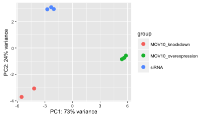

Approximate time: 75 minutes

## Learning Objectives 

* Understand the dataset
* Getting setup in R (project setup, loading data, loading libraries)
* Becoming familiar with the `DESeqDataSet` object 
* Evaluating quality of samples using data visualization tools
 
## Overview of dataset
We have been working with 8 files from the Mov10 dataset so far and they are replicates belonging to 3 conditions as shown below:


***What does Mov10 do? What is the purpose of these datasets?***

**MOV10**, is a putative RNA helicase that is also associated with **FMRP** in the context of the microRNA pathway. FMRP and MOV10 associate and regulate the translation of a subset of RNAs


**FMRP** is “most commonly found in the brain, is essential for normal cognitive development and female reproductive function. Mutations of this gene can lead to fragile X syndrome, mental retardation, premature ovarian failure, autism, Parkinson's disease, developmental delays and other cognitive deficits.” - from [wikipedia](https://en.wikipedia.org/wiki/FMR1)

**Our questions:**
* What patterns of expression can we identify with the loss or gain of MOV10? 
* Are there any genes shared between the two conditions?

These data are from a paper entitled "*MOV10 and FMRP regulate AGO2 association with microRNA recognition elements*" ([Kenny, P.J. *et al*, Cell Reports, 11 December 2014](http://www.sciencedirect.com/science/article/pii/S2211124714009231)).

## Differential expression analysis
Thus far, we have described different strategies for RNA-Seq data (i.e. de novo transcriptome assembly, transcript discovery) but arguably the most common use for transcriptome data is to to search for differentially expressed genes. Finding genes that are differentially expressed between conditions is an integral part of understanding the molecular basis of phenotypic variation.

There are a number of software packages that have been developed for differential expression analysis of RNA-seq data, and new methods are continuously being presented. Many studies describing comparisons between these methods show that while there is some agreement, there is also much variability. **Additionally, there is no one method that performs optimally under all conditions [[Soneson and Dleorenzi, 2013](https://bmcbioinformatics.biomedcentral.com/articles/10.1186/1471-2105-14-91)].**


 

 


In the next few lessons, we will walk you through an **end-to-end gene-level RNA-seq differential expression workflow** using various R packages. We will start with a count matrix and perform exploratory data analysis for quality assessment and to explore the relationship between samples, perform differential expression analysis, and visually explore the results.

## Setting up

Let's get started by opening up RStudio and setting up a new project for this analysis. 

1. Go to the `File` menu and select `New Project`.
2. In the `New Project` window, choose `New Directory`. Then, choose `Empty Project`. Name your new directory `DEanalysis` and then "Create the project as subdirectory of:" the Desktop (or location of your choice).
3. After your project is completed, it should automatically open in RStudio. 

To check whether or not you are in the correct working directory, use `getwd()`. The path `Destktop/DEanalysis` should be returned to you in the console. Within your working directory use the `New folder` button in the bottom right panel to create three new directories: `data`, `meta` and `results`. Remember the key to a good analysis is keeping organized from the start!

Go to the `File` menu and select `New File`, and select `R Script`. This should open up a script editor in the top left hand corner. This is where we will be typing and saving all commands required for this analysis. In the script editor type in a header line:

```
## Gene-level differential expression analysis using DESeq2
## NGS Data Analysis 2016
```

Now save the file as `de_script.R`. When finished your working directory should now look something like this:


Finally, we need to grab the files that we will be working with for the analysis. 

***Note:*** *We are going to switch to using count data for the* ***full dataset*** *from this point onwards, to get more meaningful results from the differential expression analysis. We are also obtaining the metadata file afresh for the DEanalysis project.*

Right click on the links below, and choose the "Save link as ..." option to download:

* Save the [full counts matrix](https://raw.githubusercontent.com/hbc/NGS_Data_Analysis_Course/master/sessionIII/data/Mov10_full_counts.txt) file in the `data` directory.
* Save the [full metadata table](https://raw.githubusercontent.com/hbc/NGS_Data_Analysis_Course/master/sessionIII/data/Mov10_full_meta.txt) file in the `meta` directory.


## Loading libraries

For this analysis we will be using several R packages, some which have been installed from CRAN and others from Bioconductor. To use these packages (and the functions contained within them), we need to **load the libraries.** Add the following to your script and don't forget to comment liberally!

```
## Setup
### Bioconductor and CRAN libraries used
library(ggplot2)
library(RColorBrewer)
library(DESeq2)
library(pheatmap)
```

## Loading data

To load the data into our current environment, we will be using the `read.table` function. We need to provide the path to each file and also specify arguments to let R know that we have a header (`header = T`) and the first column is our row names (`row.names =1`). By default the function expects tab-delimited files, which is what we have.

```
## Load in data
data <- read.table("data/Mov10_full_counts.txt", header=T, row.names=1) 

meta <- read.table("meta/Mov10_full_meta.txt", header=T, row.names=1)
```

Use `class()` to inspect our data and make sure we are working with data frames:


	### Check classes of the data we just brought in
	class(data)
	class(meta)


As a sanity check we should also make sure that we have sample names that match between the two files, and that the samples are in the right order.

	### Check that sample names match in both files
	all(names(data) %in% rownames(meta))
	all(names(data) == rownames(meta))
	
***

**Exercise**	

Suppose we had sample names matching in the counts matrix and metadata file, but they were out of order. Write the line(s) of code required to create a new matrix with columns ordered such that they were identical to the row names of the metadata.

*** 


## `DESeq2DataSet`

Now that we have all the required files and libraries loaded we are ready to begin with the exploratory part of our analysis. 

Amongst the DE tools that work on count data directly, a popular one is [DESeq2](https://bioconductor.org/packages/release/bioc/html/DESeq2.html). The methodology of DESeq2 (as described in the lecture) has high sensitivity and precision, while controlling the false positive rate. It also has various functions for QC assessment conveniently built-in.

The first thing we need to do is create `DESeqDataSet` object. Bioconductor software packages often define and use a custom class for storing data that makes sure that all the needed 'data slots' are consistently provided and fulfill the requirements. These objects are similar to `lists` in that the `data slots` are analogous to components as they store a number of different types of data structures. These objects are **different from lists** in that the slots are designated for specific information and access to that information (i.e. selecting data from the object) is by using object-specific functions as defined by the package.

Let's start by creating the `DESeqDataSet` object and then we can talk a bit more about what is stored inside it. To create the object we will need the **count matrix** and the **metadata** table as input. We will also need to specify a **design formula**. The design formula specifies the column(s) in the metadata table and how they should be used in the analysis. For our dataset we only have one column we are interested in, that is `~sampletype`. This column has three factor levels, which tells DESeq2 that for each gene we want to evaluate gene expression change with respect to these different levels.


	## Create DESeq2Dataset object
	dds <- DESeqDataSetFromMatrix(countData = data, colData = meta, design = ~ sampletype)


You can use DESeq-specific functions to access the different slots and retrieve information, if you wish. For example, suppose we wanted the original count matrix we would use `counts` (*Note: we nested it within the `View` function so that rather than getting printed in the console we can see it in the script editor*) :

	View(counts(dds))

As we go through the workflow we will use the relevant functions to check what information gets stored inside our object.


## Normalization of counts

The next step is to normalize the count data in order to be able to make fair gene comparisons both within and between samples.


Remember, that there are other factors that are proportional to the read counts in addition to the gene expression that we are interested in. In DESeq2, `sizeFactors` are computed based on the median of ratios method. This method accounts for gene length and sequencing depth. To generate these size factors we can use the `estimateSizeFactors()` function:

	dds <- estimateSizeFactors(dds)

By assiging the results back to the `dds` object we are filling in the slots of the `DESeqDataSet` object with the appropriate information. Now, to retrieve the normalized counts matrix from `dds`, we use the `counts()` function and add the argument `normalized=TRUE`.

	normalized_counts <- counts(dds, normalized=TRUE)
  
We can save this normalized data matrix to file for later use:

	write.table(normalized_counts, file="data/normalized_counts.txt", sep="\t", quote=F, col.names=NA)

## Transformation of counts

Many common statistical methods for exploratory analysis of multidimensional data, e.g. clustering and principal components analysis (PCA), work best for data that generally have the **same range of variance at different ranges of the mean values**. For RNA-seq raw counts, however, the variance grows with the mean. So the results of a PCA will be largely driven by genes with many counts.

A simple and commonly used strategy to avoid this is to take the logarithm of the normalized count values plus a small pseudocount (for 0 counts); however, now the genes with the very lowest counts will tend to dominate the results.

The DESeq2 solution to this is the **regularized log transform** [[Love, Huber, and Anders 2014](http://www.ncbi.nlm.nih.gov/pmc/articles/PMC4302049/pdf/13059_2014_Article_550.pdf)]. For genes with high counts, the `rlog` transformation will give similar result to the ordinary log2 transformation of normalized counts. For genes with lower counts, however, the values are shrunken towards the genes’ means across all samples.


	### Transform counts for data visualization
	rld <- rlog(dds, blind=TRUE)

The `rlog` function returns a `DESeqTransform`, another type of DESeq-specific object. The reason you don't just get a matrix of transformed values is because all of the parameters (i.e. size factors) that went in to computing the rlog transform are stored in that object. We can use this object to plot figures for quality assessment.


## Quality assessment and exploratory analysis	


### Principal components analysis (PCA)

One way to visualize sample-to-sample distances is a principal components analysis (PCA). DESeq2 has a built-in function for plotting PCA plots, that uses `ggplot2` under the hood. This is great because it saves us having to type out lines of code and having to fiddle with the different ggplot2 layers. In addition, it takes the `rlog` object as an input directly, hence saving us the trouble of extracting the relevant information from it.

The function `plotPCA()` requires two arguments as input: an `rlog` object and the `intgroup` (the column in our metadata that we are interested in). 

	### Plot PCA 
	plotPCA(rld, intgroup=c("sampletype"))



**What does this plot tell you about the similarity of samples? Does it fit the expectation from the experimental design?** By default the function uses the *top 500 most variable genes*. You can change this by adding the `ntop` argument and specifying how many genes you want to use.

***

**Exercise**

Plot the PCA using *all of the genes* in your original count matrix. *Hint: you can use `nrow()` to help get the total number of genes*

***

### Hierarchical Clustering

Another method for quality assessment of data is to cluster samples based on how dis/similar they are to one another. In this lesson, we will be using the Pearson correlation to measure similarity between samples. Alternatively, it is also common to compute distance-based measures (i.e Poisson distance) as input to clustering. 


Using correlation values is referred to as an inter-correlation analysis (ICA). This involves taking each sample as a vector of ~22k values and then making pair-wise comparisons between all samples by computing a Pearson correlation. Generally, we expect to see a fairly high correlation (> 0.95) between all samples for a good dataset. Additionally, we expect to see samples clustered similar to the groupings observed in a PCA plot.

Samples that show particularly low correlation values with all other samples (< 0.80) represent outliers. These samples are usually removed. Additionally, the heatmap is useful in identifying batch effects based on block structures that correspond to when the samples were run.

Since there is no built-in function for heatmaps in DESeq2 we will be using `pheatmap()`. This function requires a matrix/dataframe of numeric values as input, and so the first thing we need to is retrieve that information from the `rld` object:
	
	### Extract the rlog matrix from the object
	rld_mat <- assay(rld) 

Then we need to compute the pairwise correlation values for samples. We can do this using the `cor()` function:

	### Compute pairwise corrrelation values
	rld_cor <- cor(rld_mat)


And now to plot the correlation values as a heatmap:

	### Plot heatmap
	pheatmap(rld_cor)


Overall, we observe pretty high corelations across the board ( > 0.999) suggesting no outlying sample(s). Also, similar to the PCA plot you see the samples clustering together by sampletype. Together, these plots suggest to us that the data are of good quality and we have the green light to proceed to differential expression analysis.


> NOTE: The `pheatmap` function has a number of different arguments that we can alter from default values to enhance the aesthetics of the plot. If you are curious and want to explore more, try running the code below. *How does your plot change?* Take a look through the help pages (`?pheatmap`) and identify what each of the added arguments is contributing to the plot.
>
> ```
> heat.colors <- brewer.pal(6, "Blues")
> pheatmap(rld_cor, color = heat.colors, border_color=NA, fontsize = 10, 
>			fontsize_row = 10, height=20)
> ```              


## Saving the Project

Now we are set up to run the comparisons between the 3 groups and get lists of differentially expressed genes. **Make sure you save your R session as you quit RStudio to your DEanalysis project, so you don't lose all your work from this setting up module!**


---
*This lesson has been developed by members of the teaching team at the [Harvard Chan Bioinformatics Core (HBC)](http://bioinformatics.sph.harvard.edu/). These are open access materials distributed under the terms of the [Creative Commons Attribution license](https://creativecommons.org/licenses/by/4.0/) (CC BY 4.0), which permits unrestricted use, distribution, and reproduction in any medium, provided the original author and source are credited.*
