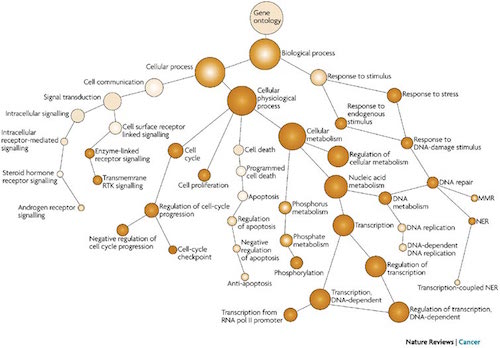

Learning Objectives:
-------------------

*  with various functional analysis tools

# Functional analysis using gene lists

The output of RNA-Seq differential expression analysis is a list of significant differentially expressed genes (DEGs). These DEGs can be explored in greater detail to learn more about the roles these genes may be playing in the condition of interest, by performing any of the following analyses:

- determining whether there is enrichment of known biological functions or interactions, pathways, or networks
- identifying genes of novel pathways or networks by grouping genes together based on similar trends
- understanding global changes in gene expression by visualizing all genes being significantly up- or down-regulated.

Generally for any differential expression analysis, it is useful to investigate functional enrichment and pathways associated with the DEGs using freely available web-based tools.  Popular tools frequently used for such analyses include gProfiler, Revigo, and GeneMANIA.

## Functional enrichment tools
There are a plethora of functional enrichment tools available to choose from; however, many of these tools query databases with information about gene function and interactions. The ability of these tools to query databases for gene function is due to the use of a consistent vocabulary used by independent databases to describe gene function. This vocabulary was established by the Gene Ontology project, and the vocabulary terms are called Gene Ontology (GO) terms. 

"The Gene Ontology project is a collaborative effort to address the need for consistent descriptions of gene products across databases" [1](geneontology.org/page/documentation). The Gene Ontology (GO) Consortium maintains a structured and controlled vocabulary, known as GO terms, to describe the roles of genes and gene products. These GO terms are incorporated into gene annotations in many of the popular repositiories for animal, plant, and microbial genomes ((List of collaborating databases)[http://geneontology.org/page/go-consortium-contributors-list]). Tools that investigate **enrichment of biological functions or interactions** can query these databases for GO terms associated with a list of genes to determine whether any GO terms associated with particular functions or interactions are enriched in the gene set. Therefore, to best use and interpret the results from these functional analysis tools, it is helpful to have a good understanding of the GO terms themselves.

### GO terms

#### GO term ontologies

To describe the roles of genes and gene products, GO terms are organized into three independent controlled vocabularies ()ontologies: **biological processes**, **molecular functions**, and **cellular components**. 

- *Biological process:* refers to the biological role involving the gene or gene product, and could include "transcription", "signal transduction", and "apoptosis". A biological process generally involves a chemical or physical change of the starting material or input.
- *Molecular function:* represents the biochemical activity of the gene product, such activities could include "ligand", "GTPase", and "transporter". A biological process can include one or many molecular functions. 
- *Cellular component:* refers to the location in the cell of the gene product. Cellular components could include "nucleus", "lysosome", and "plasma membrane".

#### GO term heirarchy

Since some gene products are well-researched, with large quantities of data available regarding their biologic

#### gProfiler

[gProfileR](http://biit.cs.ut.ee/gprofiler/index.cgi) is a web-based tool for the interpretation of large gene lists. The core tool takes a gene list as input and performs statistical enrichment analysis to provide interpretation to user-provided gene lists. Multiple sources of functional evidence are considered, including Gene Ontology terms, biological pathways, regulatory motifs of transcription factors and microRNAs, human disease annotations and protein-protein interactions. The user selects the organism and the sources of evidence to test. There are also additional parameters to change various thresholds and tweak the stringency to the desired level. 

Take your gene list and paste it in the `Query' box. 

* Under **Options**: keep all defaults checked but for _Hierarchical Filtering_ use the pulldown to select _Best per parent_
* Choose **Show advanced options** and change the _Significance threshold_ to _Benjamini-Hochberg_
* From the functional evidence selections choose the following: Gene Ontology (biological process, molecular function), KEGG, Reactome
* Press **g:Profile!** 

> Take a look at the list of terms that appear. Do you see anything relevant, given what you know about this dataset? Run the analysis again but this time change the appropriate parameter to export your results to file. 

#### GeneMANIA

[GeneMANIA](http://genemania.org/) is another tool for predicting the function of your genes. Rather than looking for enrichment, the query gene set is evaluated in the context of curated functional association data and results are displayed in the form of a network. Association data include protein and genetic interactions, pathways, co-expression, co-localization and protein domain similarity. Genes are represented as the nodes of the network and edges are formed by known association evidence. The query gene set is highlighted and so you can find other genes that are related based on the toplogy in the network. This tool is more useful for smaller gene sets (< 400 genes), as you can see in the figure below our input results in a bit of a hairball that is hard to interpret.

> Use the significant gene list generated from the analysis we performed in class (~40 genes) as input to GeneMANIA. Using only pathway and coexpression data as evidence, take a look at the network that results. Can you predict anything functionally from this set of genes? 

### Resources for R

* https://www.datacamp.com/courses/free-introduction-to-r
* Software Carpentry materials: http://swcarpentry.github.io/r-novice-inflammation/
* Data Carpentry materials: http://tracykteal.github.io/R-genomics/
* Materials from IQSS at Harvard: http://tutorials.iq.harvard.edu/R/Rintro/Rintro.html
* [swirl](http://swirlstats.com/): learn R interactively from within the R console
* The free "try R" class from [Code School](http://tryr.codeschool.com)
* HarvardX course ["Statistics and R for the Life Sciences"](https://courses.edx.org/courses/HarvardX/PH525.1x/1T2015/info)

