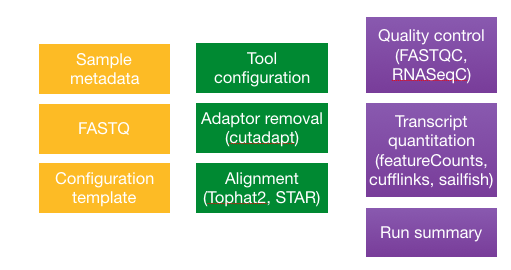
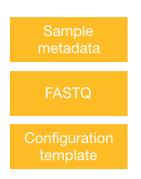
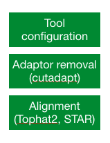

Approximate time: 90 minutes


## NGS pipelines

As you can see from our RNA-seq lessons so far, the analysis workflow is a multi-step process. We learned what is involved in running each individual step, and the details on inputs and outputs. Finally, we demonstrated how to combine the different steps into a single script for automation of the entire workflow from start to finish.

An alternative to creating your own pipeline for the analysis of your next-generation sequencing data, it to use an existing one. There are a number of pipelines available both commerical and academic, with some that are specific to a particular NGS experiment (i.e [variant calling](https://www.broadinstitute.org/gatk/), [RNA-seq](http://www.biomedcentral.com/content/pdf/1471-2164-16-S6-S3.pdf), [viral NGS analysis](http://viral-ngs.readthedocs.org/en/latest/)).

The pipeline we will be presenting here is [bcbio-nextgen](https://bcbio-nextgen.readthedocs.org/en/latest/).


## `bcbio-nextgen`

bcbio-nextgen is a shared community resource for handling the data processing of various NGS experiments including variant calling, mRNA-seq, small RNA-seq and ChIP-seq. It is an open-source toolkit created by Brad Chapman with a lot of support (testing, bug reports etc.) and development from the large [user community](https://bcbio-nextgen.readthedocs.org/en/latest/contents/introduction.html#users).

> *"A piece of of software is being sustained if people are using it, fixing it, and improving it rather than replacing it"*
> -[Software Carpentry](http://software-carpentry.org/blog/2014/08/sustainability.html)
>

bcbcio-nextgen provides *best-practice* piplelines with the goal of being:

* Scalable: Handles large datasets and sample populations on distributed heterogeneous compute environments
* Well-documented
* Easy(ish) to use: Tools come pre-configured
* Reproducible: Tracks configuration, versions, provenance and command lines
* Analyzable: Results feed into downstream tools to make it easy to query and visualize

It is availble for installation on most Linux systems (compute clusters), and also has instructions for setup on the Cloud. It is currently installed on on the Orchestra cluster, and so we will demonstrate `bcbio-nextgen` for RNA-seq data using our Mov10 dataset as input.

The figure below describes the input (yellow), workflow (green) and output (purple) components of `bcbio`:

 

As we work through this lesson we will introduce each component in more detail.


## Setting up

Let's get started by logging on to Orchestra and starting an interactive session:

	bsub -Is -q interactive bash
	
The first thing we need to do in order to run `bcbio`, is setup some environment variables. Rather than just modifying them in the command-line, we will be adding it to our `.bashrc` file which is  located in your home directory. The `.bashrc` is a shell script that Bash runs whenever it is started interactively. You can put any command in that file that you could type at the command prompt, and is generally used to set an environment and customize things to your preferences.

Open up your `.bashrc` using `vim` and add in the following:

	# Environment variables for running bcbio
	export PATH=/opt/bcbio/centos/bin:$PATH
	
	unset PYTHONHOME
	unset PYTHONPATH

 
Close and save the file. Finally, let's set up the project structure. Change directories into `~/ngs_course/rnaseq` and make a directory called `bcbio-rnaseq`:

	cd ~/ngs_course/rnaseq
	mkdir bcbio-rnaseq


## `bcbio`: Inputs

There are three things required as input for your `bcbio` run:

 

The files we will use as input are the **raw untrimmed FASTQ files**. We will need to copy them over from the `hbctraining` directory and into our current directory:

	cp /groups/hbctraining/ngs-data-analysis2016/rnaseq/bcbio-rnaseq/*.fq .


In addition to the data files, `bcbio` requires a **comma separated value file containing sample metadata**. The first column must contain the header `samplename` which corresponds to the FASTQ filenames you are running the analysis on. You can add a `description` column to change the sample name originally supplied by the file name, to this value (i.e. a short name). And finally, any columns that follow can contain additional information on each sample.

We have created this file for you, you will need to copy it over to your current directory.

	cp /groups/hbctraining/ngs-data-analysis2016/rnaseq/bcbio-rnaseq/mov10_project.csv .
	
Each line in the file corresponds to a sample, and each column has information about the samples.

```
samplename,description,condition
Irrel_kd_1.subset.fq,Irrel_kd1,control
Irrel_kd_2.subset.fq,Irrel_kd2,control
Irrel_kd_3.subset.fq,Irrel_kd3,control
Mov10_oe_1.subset.fq,Mov10_oe1,overexpression
Mov10_oe_2.subset.fq,Mov10_oe2,overexpression
Mov10_oe_3.subset.fq,Mov10_oe3,overexpression
```

The final requirement is a **configuration template**, which will contain details on the analysis options. The template file is used in combination with the metadata file, and the FASTQ files to create a **config file** which is ultimately the input for `bcbio`.

You can start with one of the provided [best-practice templates](https://github.com/chapmanb/bcbio-nextgen/tree/master/config/templates) and modify it as required, or you can create your own. We have created a template for you based on the experimental details. Copy it over and then use `less` to take a look at what is inside.

	cp /groups/hbctraining/ngs-data-analysis2016/rnaseq/bcbio-rnaseq/mov10-template.yaml .
	less mov10-template.yaml
	
```
# Template for human RNA-seq using Illumina prepared samples
---
details:
  - analysis: RNA-seq
    genome_build: hg19
    algorithm:
      aligner: star
      quality_format: standard
      trim_reads: False
      strandedness: firststrand 
upload:
  dir: ../final
```

You should observe indentation which is characteristic of the **YAML file format** (YAML Ain't Markup Language). YAML is a human friendly data serialization standard for all programming languages. It takes concepts from languages such as C, Perl, and Python and ideas from XML. The data structure hierarchy is maintained by **outline indentation**.

The configuration template defines `details` of each sample to process, including : `analysis` (i.e. RNA-seq, chipseq, variant), `genome_build`, and `algorithm` specifics for each tool that is being used in the workflow. Other details include `metadata`, which will be added via the `.csv` when creating the final config file. At the end of the template we define `upload` which is for the final ouput from `bcbio`. To find out more on the details that can be added to your YAML, check out the [readthedocs](https://bcbio-nextgen.readthedocs.org/en/latest/contents/configuration.html#sample-information). 	
	 
We can now apply this template to all samples in our dataset. To do this we use the	template workflow command, which takes in the template, the metadata and the samples:  

	bcbio_nextgen.py -w template mov10-template.yaml mov10_project.csv *.fq
	
Upon completion of the command you should see the following output:

`Configuration file created at: /home/mm573/ngs_course/rnaseq/bcbio-rnaseq/mov10_project/config/mov10_project.yaml`

If you take a look in your current directory, you will also find that a **new directory** has been created by the same name as your csv file `mov10_project`. Inside that directory you will find the following directory structure:

```
mov10_project/
├── config
└── work
```


## `bcbio`: Workflow

Before we actually run the analysis, let's talk a bit about the tools that will be run and some of the `algorithm` details we specified for these tools. The RNA-seq pipeline includes steps for quality control, adapter trimming, alignment, variant calling, transcriptome reconstruction and post-alignment quantitation at the level of the gene and isoform.


 
For quality control, the FASTQC tool is used and we selected `standard` to indicate the stadard fastqsanger quality encoding. [qualimap](http://qualimap.bioinfo.cipf.es/) is another tool used to report QC according to the features of the mapped reads and provides an overall view of the data that helps to the detect biases in the sequencing and/or mapping of the data. 

Trimming is not required unless you are using the Tophat2 aligner. Adapter trimming is very slow, and aligners that soft clip the ends of reads such as STAR and hisat2, or algorithms using pseudoalignments like Sailfish handle contaminant sequences at the ends properly. This makes trimming unnecessary, and since we have chosen `star` as our aligner we have also set `trim_reads: False`. *Tophat2 does not perform soft clipping so if that is the aligner that is chosen, trimming must still be done.*

Counting of reads is done using featureCounts and does not need to be specfied in the config file. Also, Sailfish, which is an extremely fast alignment-free method of quantitation, is run for all experiments. There is also an option for Cufflinks to be run if you wanted to look at isoform level expression differences using the Tuxedo suite of tools. The outputs generated are per-sample GTF files and an FPKM matrix.

### Creating a job script to run `bcbio`

Upon creation of the config file, you will have noticed two directories were created. The `work` directory is created becasue that is where `bcbio` expects you to run the job.

Let's move into this directory:
	
	cd mov10_project/work

To run `bcbio` we call the same python script that we used for creating the config file `bcbio_nextgen.py` but we add different parameters:

* `../config/mov10_project.yaml`: specify path to config file relative to the `work` directory
* `-n 64`: total number of cores to use on the cluster during processing. The framework will select the appropriate number of cores and type of cluster (single core versus multi-core) to use based on the pipeline stage.
* `-t ipython`: use python for parallel execution
* `-s lsf`: type of scheduler
* `-q priority`: queue to submit jobs to
* `--retries 3`: number of times to retry a job on failure
* `--timeout 380`: numbers of minutes to wait for a cluster to start up before timing out
* `-rW=72:00`: specifies resource options to pass along to the underlying queue scheduler

`bcbio` pipeline runs in parallel using the IPython parallel framework. This allows scaling beyond the cores available on a single machine, and requires multiple machines with a shared filesystem like standard cluster environments. 
Although, we will only ask for a single core in our job submission script `bcbio` will use the parameters provided in the command to spin up the appropriate number of cores required at each stage of the pipeline.

> **NOTE:** Since `bcbio` will spawn a number of intermediate files as it goes through the pipeline of tools, you will need to make sure there is enough disk space to hold all of those files. **Your home directory on Orchestra will not be able to handle this amount of data.** Instead we recommend talking to the folks at HMS RC to set up a directory in the `/groups` folder for your lab. For this lesson, since we are using a small subset of the original data running in your home directory *should not be problematic*.

The job can take on the range of hours to days depending on the size of your dataset, and so rather than running interactively we will create a job submission script. 


```
#!/bin/sh

#BSUB -q priority
#BSUB -J bcbio_mov10
#BSUB -n 1
#BSUB -W 100:0
#BUSB -R “rusage[mem=10000]”
#BSUB -e mov10_project.err

bcbio_nextgen.py ../config/mov10_project.yaml -n 64 -t ipython -s lsf -q priority '-rW=72:00' --retries 3 --timeout 380
```


## `bcbio`: Output


### Run summary

The results of the run will be summarized for you in a new directory called `final` as specified in our config file. The directory will be located in your project directory:

```
mov10_project/
├── config
├── work
└── final
```

Inside the `final` directory you will find individual directories for each sample in your dataset, in addition to a date-stamped folder. The date-stamped folder will contain a  number of different expression matrices for your dataset generated by different quantification tools.

There is also a run summary called `project-summary` in YAML format. The content of this file describes various quality metrics for each sample post-alignment. You will also find a file called `programs.txt`. Here, are the programs and the corresponding versions that were used.

### Log files


Now let's take a look at the `work` folder. Here, you will find that there are many new directories and files. For each step of pipeline, new job submission scripts were generated as were various intermediate files and directories. 
Since the important files were collated and placed in the `final` directory, the only other important directory is the `logs` directory. 
 
 There are three logging files in the log directory within your `logs` folder (two of which are also in your `final` directory):

1. `bcbio-nextgen.log`: High level logging information about the analysis. This provides an overview of major processing steps and useful checkpoints for assessing run times.
2. `bcbio-nextgen-debug.log`: Detailed information about processes including stdout/stderr from third party software and error traces for failures. Look here to identify the status of running pipelines or to debug errors. It labels each line with the hostname of the machine it ran on to ease debugging in distributed cluster environments.
3. `bcbio-nextgen-commands.log`: Full command lines for all third party software tools run.


***
*This lesson has been developed by members of the teaching team at the [Harvard Chan Bioinformatics Core (HBC)](http://bioinformatics.sph.harvard.edu/). These are open access materials distributed under the terms of the [Creative Commons Attribution license](https://creativecommons.org/licenses/by/4.0/) (CC BY 4.0), which permits unrestricted use, distribution, and reproduction in any medium, provided the original author and source are credited.*
