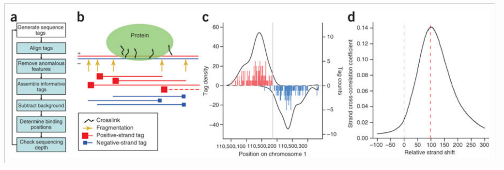

Contributors: Meeta Mistry

Approximate time: 90 minutes

## Learning Objectives

* Learning how to use SPP for peak calling
* Understanding different components of the SPP algorithm
* Interpretation of results from a peaks including cross-correlation plots and narrowPeak files 

## Peak calling

Peak calling, the next step in our workflow, is a computational method used to identify areas in the genome that have been enriched with aligned reads as a consequence of performing a ChIP-sequencing experiment. 

From the alignment files (BAM), you typically observe reads to be identified on each side of the binding site for the protein of interest. The 5' ends of the selected fragments will form groups on the positive- and negative-strand. The distributions of these groups are then assessed using statistical measures and compared against background (input or mock IP samples) to determine if the binding site is significant.

## SPP

SPP is a data processing pipeline optimized for detection of localized protein binding positions from unpaired sequence reads. The [publication](http://www.nature.com.ezp-prod1.hul.harvard.edu/nbt/journal/v26/n12/full/nbt.1508.html) describes the algorithm in great detail, from which we have listed some of the main features here.

* Discarding or restricting positions with abnormally high number of tags
* Provides smoothed tag density in WIG files for viewing in other browsers
* Provides conservative statistical estimates of fold enrichment ratios along the genome, to determine regions of significant enrichment/depletion (can be exported for visualization)

The main steps of the ChIP-seq processing pipline are described in the illustration below. As we walk through the SPP pipeline in this lesson, we will describe each step in more detail.

SPP is an R package which can be installed in one of two ways. There is [source code](https://github.com/hms-dbmi/spp/archive/1.13.tar.gz) avaiable for download, or alternatively it can be installed using `devtools` as it is now [available on GitHub](https://github.com/hms-dbmi/spp).

For more information on SPP the [home page](http://compbio.med.harvard.edu/Supplements/ChIP-seq/) is quite useful, as they provide a brief tutorial showing the use of the main methods.

## Setting up

Exit your current session on Orchestra if you are currently in an interactive session, and restart one using default settings. Since we are working with such a small dataset we will just use a single core, for parallel processing options with SPP see note below.

	$ bsub -Is -q interactive bash

Now let's setup the directory structure. Navigate to `~/ngs_course/chipseq/` if you are not already there. Within the results directory we will create directory called `spp`:

	$ mkdir results/spp
	
The last thing we need to before getting started is load the appropriate	software. As mentioned, SPP is an R package. On Orchestra it comes installed by default when you load the most recent R module:

	$ module load stats/R/3.2.1

> ### Parallel processing with SPP
> 	
> When working with large datasets it can be beneficial to use multiple cores during some of the more computationally intensive processes. In order to do so, you will need to install the `snow` packagein R. Using snow you can initialize a cluster of nodes for parallel processing (in the example below we have a cluster of 8 nodes). *See `snow` package manual for details.* This cluster variable can then be used as input to functions that allow for parallel processing.
> 
> 	`library(snow)`
> 	
> 	`cluster <- makeCluster(8)`

